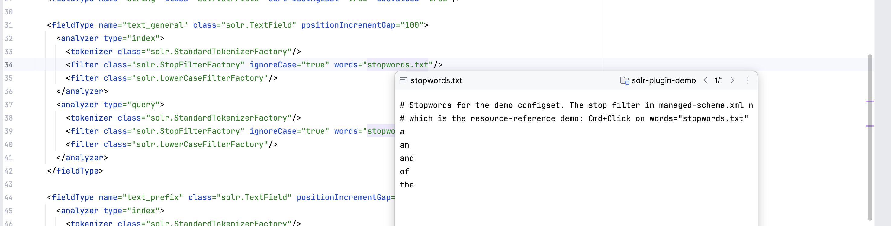
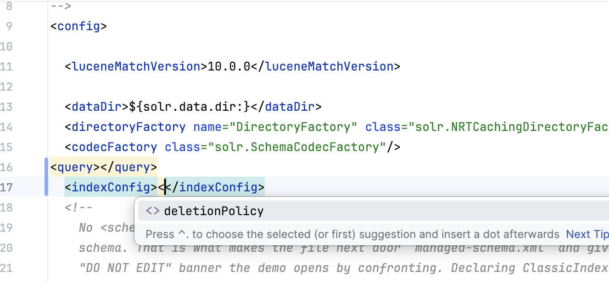
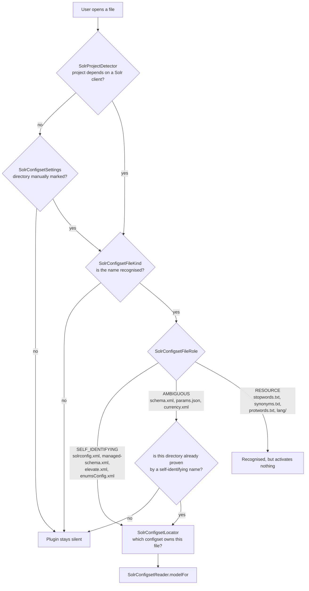
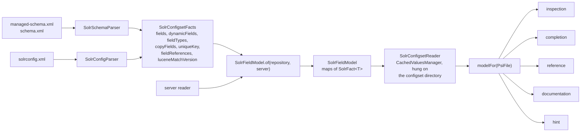
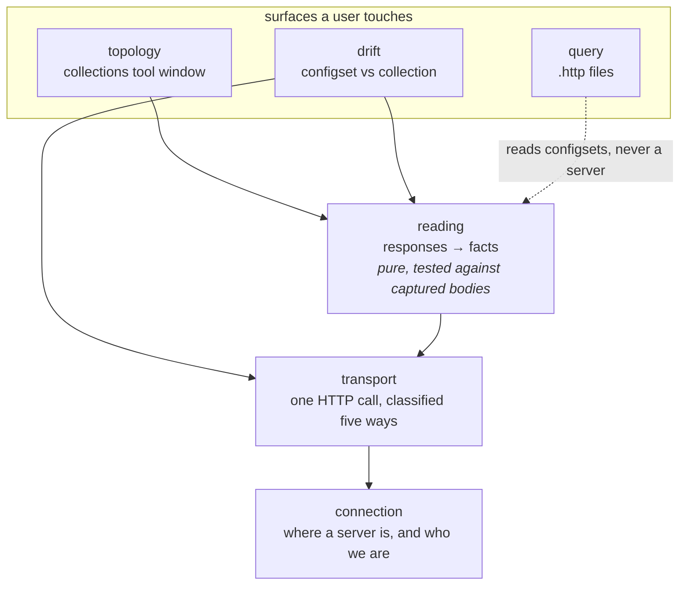

# Code organization

> **Who this is for.** A Java engineer new to both Apache Solr and the IntelliJ Platform who needs
> to know which package a change belongs in, and what each package boundary forbids.
> **Read first:** [Glossary](glossary.md) if Solr or IntelliJ Platform terms are new ·
> [contributing.md](contributing.md)

Where a change goes, and what the package you put it in will not let you do.

This is the human-facing account. The API reference renders the same structure from KDoc — run
`./gradlew dokkaGenerate` and open `build/dokka/html`, or download the `api-documentation` artifact
from any CI run. [`specs/plans/0002-solr-intellij-plugin-plan.md`](../specs/plans/0002-solr-intellij-plugin-plan.md)
owns which of it is built — **do not infer status from this file**.

## The organising principle

Packages are organised **by surface, then by subject, then by gesture** — and the third level
collapses wherever there is only one gesture.

The specification describes three surfaces — configuration files, a live server, and Java/Kotlin
code — unified by one model of what fields exist and what they can do. Those surfaces are the top
level. Inside a surface comes *which Solr thing this is about*: for [`configset`](glossary.md#configset)
that is the file, `schema` or `solrconfig`. Only then comes the IDE gesture —
[`inspection`](glossary.md#inspection), `completion`, [`reference`](glossary.md#reference),
`documentation` — and each of those is **one capability, not one layer**: there is no `service`
package, no `util`, no `impl`.

The middle level is what makes the tree say what a change is *about* rather than only which
[extension point](glossary.md#extension-point) it uses. `SolrSchemaParser` and `SolrConfigParser`
read entirely different files and share no vocabulary; as peers in one `parsing` package only their
class names said so.

> **In Java terms.** An extension point is an SPI. `plugin.xml` is `META-INF/services`, the platform
> is the `ServiceLoader`, and it calls you — you never construct these classes yourself.

**A capability falls under an aspect when the caret that triggers it is always in that aspect's
file.** "Caret" here is doing more work than the word usually carries: ask which file the user's
cursor is sitting in at the moment the capability fires, and that answer is the package it belongs
in. A completion provider that only ever fires with the caret inside `managed-schema.xml`, for
instance, belongs to `configset.schema` on this test alone. An inspection visits tags in one file
and reports there; a completion provider answers at a caret in one file; a reference contributor
decides which tags in which file carry references. A capability that traverses the configset by
nature has no single such file: [Find Usages](glossary.md#find-usages) starts on a schema
declaration and must reach [`solrconfig.xml`](glossary.md#solrconfigxml) to find every usage, and
[rename](glossary.md#rename-refactoring) must update the `qf` line there too — which is exactly why
a traversing capability cannot live inside one aspect's package. Those live at the configset root,
in `configset.navigation`, because filing them under `schema` would make `configset.schema` import
`configset.solrconfig`.

**The prohibition is one-directional, and reading it as symmetry gets two correct files wrong** —
`configset.reading` and `configset.navigation`, both named below, because each imports both aspects
on purpose and a symmetric reading of the rule would flag that as the same violation it is not.
Neither aspect may import the other. A package *above* the aspects may import both, and two of them
must: `configset.reading` names both parsers because choosing between them by file kind is the whole
of its job, and `configset.navigation` names both aspects' reference types because a usage-type
provider has to label a hit from either. That is not a leak — it is the composition the shared layer
exists to perform, and it is the reason those capabilities sit above the aspects rather than inside
one. The test is direction, not co-occurrence: sideways between aspects is forbidden, downward from
the shared layer into both is the design.

`org.apache.solr.ide.model` is outside the surfaces, and earns it twice over. It is what both
sources read — `SolrFact` exists precisely to hold a repository value *and* a server value — so
filing it under either would be wrong. And it is the only tree with no IntelliJ types anywhere in
it, which is what lets the correctness-critical code be tested as a plain unit test over a string
rather than inside a running IDE.

Inside `model` the same distinction runs again. `model.schema` is what a field *is*, whichever
source described it; `model.vocabulary` is what a configuration file may legally contain. The test
that separates them: **would the server reader need this to interpret what it fetched?** Solr's
schema API returns [`indexed`](glossary.md#indexed), [`stored`](glossary.md#stored),
[`omitNorms`](glossary.md#omitnorms) and [analyzer chains](glossary.md#analyzer-chain), so all of
`model.schema` applies to a [collection](glossary.md#collection). It returns JSON and has no
elements or attributes, so nothing in `model.vocabulary` will ever have a server half.

**Rule, not aside: new packages are created when they have a file to hold, not in advance.** Do not
scaffold a `configset.solrconfig.hint` package because `configset.schema.hint` exists — wait until
there is an actual hint to put in solrconfig's, the way `configset.solrconfig.descriptor` was
created only once structure completion needed somewhere to live.

## The tree

Counts are files, to show weight rather than to be kept current.

```
org.apache.solr.ide
├── SolrBundle                        every user-visible string, in one place
│
├── model                         (3) what a configset MEANS — no IntelliJ types anywhere in here
│   ├── schema                    (8)   what a field IS: its type, what it can match, what it can do
│   └── vocabulary                (2)   what a FILE may legally contain: element names, class names
│
├── configset                           the files in the repository — one of two sources of the model
│   ├── activation                (6)   is this even a Solr project, and which configset owns this file
│   ├── reading                   (3)   the whole DIRECTORY → one model. Platform-aware, and caches
│   ├── editing                   (2)   guard rails both aspects' inspections and fixes share
│   ├── navigation                (5)   the gestures that cross files: Find Usages, rename
│   │
│   ├── schema                          managed-schema.xml / schema.xml
│   │   ├── parsing               (1)     one file's TEXT → facts. No IntelliJ types at all
│   │   ├── inspection            (6)     the squiggly underline, and Alt+Enter fixes on it
│   │   ├── intention             (7)     Alt+Enter on code that is already CORRECT
│   │   ├── completion            (1)     the popup on Ctrl+Space
│   │   ├── reference             (1)     what makes a string Ctrl+Clickable
│   │   ├── documentation         (4)     the popup on F1 / hover
│   │   ├── hint                  (1)     grey text the IDE draws that is not in the file
│   │   ├── descriptor            (1)     teaching the platform's XML support this file's shape
│   │   └── annotator             (2)     dimming code that is correct but says nothing extra
│   │
│   └── solrconfig                (1)   solrconfig.xml — same gestures, fewer of them so far
│       ├── parsing               (1)
│       ├── inspection            (6)
│       ├── completion            (4)
│       ├── reference             (1)
│       ├── descriptor            (1)     the structure completion replacing the schema-less guess
│       └── documentation         (2)     the two positions the schema provider declines
│
└── server                             nothing on the editor path may import any of this
    ├── connection                (5)   how to reach a running Solr, and remembering it
    ├── transport                 (3)   the HTTP call, the credential, and how an answer is classified
    ├── reading                   (7)   a Solr response turned into facts
    ├── topology                  (4)   the collections tool window
    ├── query                     (5)   queries in `.http` files, and what their answers say
    └── drift                     (6)   configset against collection, and the writes that close a gap
```

### If you have not written an IntelliJ plugin before

Every leaf under an aspect is named for a **platform extension point** — a slot the IDE calls into.
The names are the platform's, not this plugin's, so they are worth learning once. What each one *is*
is best described by what the user sees:

| Package | What the user sees | You are changing it when |
|---|---|---|
| `inspection` | A **squiggly underline**, an entry in the Problems view, and often an Alt+Enter fix on it | Something in the file is *wrong* and the plugin should say so |
| [`intention`](glossary.md#intention) | An **Alt+Enter menu item on a file with nothing wrong with it** — no underline | You are offering an improvement or a generated edit, not reporting a defect |
| `completion` | The **popup on Ctrl+Space**, or as you type | You want to offer what may legally be written at the caret |
| `reference` | **Ctrl+Click navigates**, Find Usages finds, rename updates | A string in one file names something declared elsewhere |
| `documentation` | The **popup on F1**, or on hover | You want to explain the thing under the caret |
| `hint` | **Grey text the IDE draws inline** that is not in the file and cannot be edited | You want to annotate code without changing it |
| `descriptor` | Nothing directly — it changes what *other* features know | The platform's own XML support needs to be told this file's vocabulary |
| `activation` | Whether the plugin does **anything at all** in this project | You are changing what counts as a Solr project or configset |
| `parsing` | Nothing directly — everything else reads its output | You are changing what the plugin understands from **one file's text**. Imports no IntelliJ type, so its tests are plain JUnit over a string |
| `reading` | Nothing directly — it produces the model every feature reads | You are changing how the **whole directory** becomes one model, or how that is cached. Platform-aware: `Project`, `VirtualFile`, `Service` |

**The distinction that catches people is `inspection` versus `intention`.** Both put items behind
Alt+Enter. An inspection first says *this is wrong* — so it must not fire on a correct file, which is
[the rule this codebase cares about most](#rules-that-hold-across-every-package). An intention says
*here is something you might want*, and firing on a correct file is the whole point. If your change
would underline something, it is an inspection; if it would not, it is an intention.

**`reference` is worth more than it looks.** Implementing it once gets Ctrl+Click, Find Usages *and*
rename, because the platform builds all three on the same abstraction — which is why a string that
should be navigable is a reference rather than three separate features.

**`parsing` and `reading` are two words for what looks like one job, and the difference is the most
useful thing in this tree.** A parser turns *one file's text* into facts and knows nothing else — no
directory, no caching, and **no IntelliJ types at all**, which is what lets `SolrSchemaParser` and
`SolrConfigParser` be tested as plain JUnit over a string rather than inside a running IDE. `reading`
is the job above them: locate the configset's files, hand each to the right parser, merge the results
into one model, and cache it through the platform. It is full of `Project`, `VirtualFile` and
`Service`, and it is the only place that needs to be.

So the boundary between them is **where the platform enters**, and it is worth preserving on purpose:
a fact you can derive from a file's text belongs in `parsing`, where the test costs a millisecond. The
moment a change needs to know which file it is looking at, or wants to remember an answer, it has
crossed into `reading` — and [the caching rule](#rules-that-hold-across-every-package) applies.

## What each package puts on screen

The boundaries above are argued in the abstract, which makes them easy to read as bureaucracy. They
are not: **almost every leaf package corresponds to something a user can see**, and the central rule
— that `configset.schema` and `configset.solrconfig` may never import each other — is visible in two
screenshots side by side.

Everything below is a real capture from the demo configset. Numbers are the entries in
[the screenshot catalog](screenshots.md), which owns what each image must show and the gesture that
produces it.

### The schema aspect — `configset.schema.*`

Every capability here fires with the caret in `managed-schema.xml`, and none of them knows that
`solrconfig.xml` exists.

**1 — `configset.schema.hint`.** The inline match and storage hints, computed by `SolrMatchAnalysis`
in `model.schema` from each field's analyzer chain. No gesture: they render themselves.


**2 — `configset.schema.documentation`.** Quick documentation on a field, resolving every property
and **where each value came from** — the field, its type, or Solr's default at this schema's version.


**3 — the same package, on a `class` value.** Short name, kind, fully-qualified name, a summary read
from Solr's own Javadoc at build time, and a Reference Guide link at the declared version.


**16 — and on the schema's own `version`.** What the attribute decides in general, then what *this*
declared value decides here.


**5 — `configset.schema.completion`.** Which attributes a `<field>` accepts, each with what it takes,
and those already written withheld. Read from the property table in `model.schema`.


**6 — the same package, catalog-backed.** Inside a `<filter>`, the attributes *that factory* accepts,
recovered from its constructor bytecode at build time rather than hand-maintained.


**4 — `configset.schema.inspection`.** A dangling `copyField`, underlined, with Alt-Enter offering the
declared fields closest in spelling — the same set the inspection computed to decide it was wrong.


**11 — `configset.schema.annotator`.** An attribute whose written value equals what Solr would have
supplied anyway, dimmed. Correct rather than wrong, so it never reaches the Problems view.


**12 — `configset.schema.intention`.** The first capability that *writes* rather than explains: a
generated companion field, its type, and the `copyField` joining them.


**9 — `configset.schema.reference`.** A filter's `words=` is a real reference to the file it names.



### The `solrconfig.xml` aspect — `configset.solrconfig.*`

Same editor, same gestures, entirely different vocabulary — and no import in either direction.

**10 — `configset.solrconfig.descriptor`.** Element completion inside `<config>`, from the element
catalog in `model.vocabulary`. Set this beside **5** above: that is the whole boundary rule, in two
pictures.


**17 — the same package, one level down.** Inside `<query>` the offer is different again, because the
catalog keys every element to its parent path. `dataDir` is absent here; `filterCache` is not.


**18 — and what it refuses to offer.** Inside `<indexConfig>`, only `deletionPolicy`. `nrtMode` is
read by Solr at exactly this position and is still never offered, because completion filters to what
Solr still accepts — knowing where an element belongs and recommending it are different questions.



**15 — `configset.solrconfig.completion`.** Parameter names inside `<lst name="defaults">`, each
labelled with the Solr class that declares it.


**13 — the same package, reaching across.** Inside a `qf`, the *schema's* field names — which is the
one place this aspect consults the other, and it does it through the shared model rather than by
importing `configset.schema`.


**8 — `configset.solrconfig.reference`.** A field name written in a parameter is a reference into the
schema, and navigates there.


### Crossing both — `configset.navigation`

**7 — Find Usages.** Invoked on a `<fieldType>` declaration, it reaches the fields that name it *and*
the `qf` parameter in the other file, labelled in Solr's vocabulary rather than the platform's
generic fallback.


**14 — rename, before and after.** Renaming `category` from its schema declaration updates
`solrconfig.xml`'s `qf` as part of the same refactoring, undone by a single Cmd+Z.


**This is why the package exists.** A capability that crosses the configset has no single aspect to
live in, and filing it under either would force that aspect to import the other — the one thing the
rule forbids.

### The packages with nothing to show

`configset.solrconfig.documentation` and `configset.solrconfig.inspection` do have visible output —
parameter hovers, and the misspelled-parameter and non-indexed-field rules — that simply has no
capture yet.

But `configset.activation`, `configset.reading` and the two `parsing` packages produce nothing a user
can point at, and **that is the point of them**: they decide whether this is a configset at all, turn
its files into a model, and cache it. Every capability pictured above is a thin presentation layer
over an answer one of those four already worked out, which is why none of them had to be large.

## Where does my change go?

Two questions now, in order: **which file is the caret in**, then **what is the gesture**. If the
gesture names mean nothing to you yet, [the table above](#if-you-have-not-written-an-intellij-plugin-before)
describes each one by what the user sees.

| If you are changing… | schema files | `solrconfig.xml` |
|---|---|---|
| How **one file's text** becomes facts — no IntelliJ types, plain-JUnit tested | `configset.schema.parsing` | `configset.solrconfig.parsing` |
| Something the editor reports as wrong | `configset.schema.inspection` | `configset.solrconfig.inspection` |
| What is offered at the caret | `configset.schema.completion` | `configset.solrconfig.completion` |
| Which strings become references | `configset.schema.reference` | `configset.solrconfig.reference` |
| What a hover explains | `configset.schema.documentation` | `configset.solrconfig.documentation` |
| Something shown inline without being asked | `configset.schema.hint` | — |
| Something offered on a file already correct | `configset.schema.intention` | — |
| What the platform's XML support knows | `configset.schema.descriptor` | `configset.solrconfig.descriptor` |

And the parts that belong to no single file:

| If you are changing… | It goes in | Read first |
|---|---|---|
| What a configset *means* — fields, types, analyzer chains, what a field can match | `model.schema` | [Extend the field model](how-to/extend-the-field-model.md) |
| What a configuration file may legally contain | `model.vocabulary` | [Extend the field model](how-to/extend-the-field-model.md) |
| How the **whole directory** becomes one model, and the cache in front of it — the first place the platform appears | `configset.reading` | [Extend the field model](how-to/extend-the-field-model.md) |
| Whether the plugin runs at all, or which configset owns a file | `configset.activation` | The [activation decision](#the-activation-decision) below |
| Ctrl-click, Find Usages, rename | `configset.navigation` | [Add an editor feature](how-to/add-an-editor-feature.md) |
| Guard rails shared by both aspects' inspections and fixes | `configset.editing` | [Add an editor feature](how-to/add-an-editor-feature.md) |
| Remembering how to reach a running Solr | `server.connection` | [The server surface](#the-server-surface) below |
| Talking to one — HTTP, credentials, outcomes | `server.transport` | [The server surface](#the-server-surface) |
| Turning a Solr response into facts | `server.reading` | [The server surface](#the-server-surface) |
| The collections tool window | `server.topology` | [The server surface](#the-server-surface) |
| Queries in `.http` files | `server.query` | [The server surface](#the-server-surface) |
| Comparing a configset against a collection, and writing to one | `server.drift` | [The server surface](#the-server-surface) |
| A user-visible string | `org.apache.solr.ide` (`SolrBundle`) | — |

If your change spans two of these, that is usually correct and not a smell — an inspection reads the
model and reports through the platform, and both halves belong where they are.

**What is a smell is `configset.schema` importing `configset.solrconfig`, or the reverse.** They
share downward only, through `model`, `configset.reading`, `configset.editing` and
`configset.navigation`. A solrconfig inspection that needs to know whether a field is indexed reads
that from `model`, never from the schema aspect — which is exactly what
`SolrNonIndexedRelevanceFieldInspection` does.

> **In Java terms.** This is a dependency rule enforced by review, not by the compiler — the same
> discipline as a hexagonal-architecture port boundary between two adapters that must not know about
> each other. Nothing stops `configset.schema` from importing `configset.solrconfig` at compile time;
> what stops it is that reviewers treat it as a design violation, the way they would a controller
> importing another controller's repository directly instead of going through a shared service.

## Rules that hold across every package

These are the constraints a change can silently violate. None of them is enforced by a build gate.

**Nothing in `model` imports an IntelliJ type.** This is what makes the model testable without a
[fixture](glossary.md#fixture), and it is load-bearing rather than stylistic — roughly a third of
the test suite is plain JUnit 4 precisely because of it. One platform import costs that.

> **In Java terms.** This is the same discipline as a domain layer that imports no Spring or JPA
> type — `model` is `SolrFieldModel` and friends staying plain data, the same way a domain
> `Order` class stays a POJO instead of an `@Entity`. It buys the same thing a POJO domain model
> buys: those classes are testable with plain JUnit and no container, rather than needing
> `@SpringBootTest` — or here, `BasePlatformTestCase` — just to construct one.

**Nothing on the editor path contacts a server.** Configset editing works with no connection
configured at all. `server` is unreachable from any editor feature.

**Detection runs on every file the user opens**, so its signals stay cheap, local, and cached. A new
detection signal that reads a file, resolves a dependency graph, or walks a directory tree is on the
wrong side of that line.

**Every contribution declares itself dumb-aware, and that is a promise about data sources.** Nothing
in this plugin reads an index — the model is parsed from the configset's own text — so features work
while the project is still indexing, which is exactly when a reader is most likely to be opening
files for the first time. A future feature that *does* read an index must drop the declaration or
guard with `DumbService`. No build gate catches it if it doesn't.
[`platform-mechanisms.md`](platform-mechanisms.md) carries the reasoning.

**The plugin edits configuration files directly and never refuses a write.** Solr's default configset
carries a banner saying the file is managed by the Schema API and should not be hand-edited; the
plugin edits it anyway, because it is a source file in your repository. If you find code or docs
asking whether a write is *allowed*, it predates this decision and should go.

## The activation decision

Two gates, in order, and silence is the designed outcome outside a Solr project.



`SolrProjectDetector` matches a Solr client **by artifact id, never by version** — `solr-solrj`, or a
wrapper that carries it such as Spring Data Solr, Camel, or the Quarkus extensions. That is a fact
rather than an inference, which is why it replaced the directory heuristics an earlier revision used.

The role tiers exist because file names prove different amounts. `solrconfig.xml` carries Solr's own
vocabulary and stands alone. `schema.xml` is shared with far too many other things — an unrelated XSD
named `schema.xml` must stay untouched — so it counts only inside a directory a self-identifying name
has already proven. Resources such as `stopwords.txt` are too common to prove anything and never
activate anything, though they are recognised once inside a known configset.

`SolrConfigsetLocator` caches its answer, because this runs every time a file is opened.

A manually marked root in `SolrConfigsetSettings` bypasses the outer gate. That makes the override
**load-bearing rather than a convenience**: a repository of bare configsets has no build file, so no
dependencies to detect, and the manual root is the only way it activates at all. Those settings
persist to the shared `solr.xml` rather than workspace-local storage, because a marked root is a fact
about the project rather than about one machine — so paths are collapsed through `PathMacroManager`
on write (`$PROJECT_DIR$/core/conf`) and expanded on read. Treat `state.manualConfigsetRoots` as
storage-form only; read `manualRoots` for usable absolute paths.

## From files to the model

Every editor feature asks the same question, and it is deliberately not a question any of them
answers for itself.



`SolrConfigsetReader.modelFor(PsiFile)` lives in `configset.reading` rather than beside any one feature,
because otherwise four features would import the fifth.

The parsers are **pure functions from text to facts**, using the JDK's DOM rather than IntelliJ's XML
[PSI](glossary.md#psi), which is what lets them be tested without an IDE. External entities and doctypes are refused: a
cloned repository is not trusted input, and entity resolution would run while the user is merely
opening a file.

The model is derived from PSI, so **unsaved edits count** — PSI reflects the editor's buffer long
before anything reaches disk — and the model cannot disagree with the PSI its consumers are visiting.

The cache is the platform's `CachedValuesManager`, hung on the configset directory rather than held
in a map this plugin owns, so its lifetime is the directory's and a configset that stops existing
takes its cache with it. Its dependency list is the two source files **plus the VFS structure
count**: the first rebuilds the model when this schema changes and leaves it alone when unrelated
code does, the second notices a `solrconfig.xml` that appears later. Neither half can be dropped, and
the reflex choice of `PsiModificationTracker.MODIFICATION_COUNT` is a performance regression here: it
advances on **any** PSI change in the whole project, not just this configset's two files, so a
keystroke in an unrelated Java file would reparse both of them —
[`platform-mechanisms.md`](platform-mechanisms.md) records the full account, and draws the same trip
as a sequence: which calls happen on a cache hit, and which only on a miss.

The diagram above is the static shape. For what one caret actually does with it — the order the
platform calls a feature in, and where a null model turns into silence — see the sequences in
[the editor-feature guide](how-to/add-an-editor-feature.md).

`SolrConfigsetScanner` answers the question the per-file locator cannot: which configsets does this
*project* contain. It walks content roots and prunes build output and dependency trees, so it is not
an editor-path operation.

## The packages

### `org.apache.solr.ide`

Plugin-wide infrastructure. Currently the localization bundle, `SolrBundle`. Feature code lives in
subpackages.

### `org.apache.solr.ide.model`

What the plugin knows about a configset's fields, as data — and the one package that is not a
feature.

`SolrFieldModel` exists to merge a repository half with a server half, so it belongs to both surfaces
and filing it under either would be wrong. A fact is a `SolrFact` holding both halves and reporting
how they relate (`SolrAgreement`), rather than a value with the disagreement already resolved away.
Where only one can be shown the repository wins, because the editor's job is to reason about the file
in front of the user; the difference is surfaced rather than hidden. The server half is empty until
the server reader lands.

`SolrMatchAnalysis` derives what a field can actually match from its index-time analyzer chain. The
factories that decide it are named in code rather than read from the generated catalog, because that
set defines the semantics rather than enumerating what exists. `SolrMatchCapability` names the
*mechanism* behind partial matching rather than asserting a boolean — a wildcard query works against
any indexed field, so the useful claim is about efficiency — and carries a confidence flag, because a
wrong claim about what a field matches is worse than no claim.

`SolrClassCatalog` reads the catalog generated at build time from every supported Solr line's
artifacts — the classes a configset may name in a `class` attribute, in four kinds
(`SolrClassKind`): [field types](glossary.md#field-type), [tokenizers](glossary.md#tokenizer), token
[filters](glossary.md#filter) and [char filters](glossary.md#char-filter), each with the attribute
names it reads. Generated rather than written down because the list runs to several hundred entries
per line and changes between lines; see the `generateSolrCatalog` block in `build.gradle.kts`.
*Deliberately not counted here — this sentence said "roughly 170" until someone checked, and the
real figure is over four times that. Count it from the generated resource if you need the number.*

### `org.apache.solr.ide.configset.activation`

Deciding whether the plugin runs at all, and against which configset. See [the activation
decision](#the-activation-decision).

### `org.apache.solr.ide.configset.reading`

Reading a configset off disk into the model. See [from files to the model](#from-files-to-the-model).

### `org.apache.solr.ide.configset.schema.inspection` and `org.apache.solr.ide.configset.solrconfig.inspection`

Reporting references that go nowhere: a dangling `copyField`, a field naming an undeclared type, and
— crossing the file boundary nothing else checks — a handler parameter in `solrconfig.xml` naming a
field the schema never declares.

**The clean fixtures matter more than the flagged ones.** Solr configuration is full of syntax that
resembles a field name: `fl` legitimately holds `score`, `*`, `[docid]`, `max(price,0)` and
`alias:name`, and a glob `copyField` source is a pattern whose matches the schema alone cannot
determine. A warning on a correct file is what gets a plugin uninstalled. `SolrInspections` is where
that requirement gets teeth.

Each reference inspection offers the valid alternatives as a quick-fix, ranked by edit distance
because the common cause is a typo, and capped because a schema with eighty fields must not answer
one typo with eighty menu items. The inspection computed that set in order to decide; discarding it
and leaving the reader to find it is the difference between an editor that helps and one that
complains.

### `org.apache.solr.ide.configset.schema.completion` and `org.apache.solr.ide.configset.solrconfig.completion`

Offering the values an attribute can legally take — and answering two questions, not one. *What value
goes here*, and *what may I write at all*: the elements legal at the caret, and the attributes an
element accepts minus those it already carries. The second matters more to a reader who has not
learned the vocabulary, since a name that appears in no existing file is a name they will never meet.

**Only closed sets are completed.** Where any value is legal, nothing is contributed and the
platform's own behaviour is left alone: a list implies that the values not on it are wrong, so a
partial list in an open-ended position is worse than none. `true`/`false` are marked with the value
Solr would use if the attribute were absent — except where that default depends on the field type, in
which case neither is marked, because claiming one would assert something Solr does not.

### `org.apache.solr.ide.configset.schema.reference`, `org.apache.solr.ide.configset.solrconfig.reference` and `org.apache.solr.ide.configset.navigation`

Turning the strings that hold a configset together into references the editor understands.

References are **soft**. An unresolved hard reference draws a warning from the platform, which would
duplicate what the inspections already report and say less while doing it, in the platform's
vocabulary rather than Solr's.

A glob is followed only as far as it is written. `copyField dest="*_t"` and `dynamicField
name="*_t"` spell the same pattern literally, so landing on the declaration is exact; resolving
instead to a concrete field the pattern would match would invent a target, since which fields those
are depends on the documents indexed rather than on the schema. That is the same line the inspections
draw when they stay silent on globs.

`SolrSchemaPsi` exists because the model holds no PSI: it can say a field type exists but not where
it was written, and navigation needs the second answer.

### `org.apache.solr.ide.configset.schema.documentation` and `org.apache.solr.ide.configset.solrconfig.documentation`

Quick documentation on a schema element, on a field, and on its type; and, in the second package,
`solrconfig.xml`'s own two answerable positions.

Every position a reader would try in the schema answers: the element, a property attribute, and a
value inside one. That matters more than it sounds — the resolved property table is the one thing
here no external documentation can supply, and it was once reachable only with the caret inside a
field's `name` quotes, so hovering the element or hovering `omitNorms` itself returned something less
useful than the thing sitting one gesture away.

It answers what the Reference Guide cannot: not what `omitNorms` means in general, but what it is
*for this field in this schema*, and whether that value came from the field, from its type, or from
Solr's default. Some defaults genuinely depend on the field type, and those are reported as such
rather than given a plausible value. `SolrSchemaElements` holds what each element is and what *this*
one does where the model can say.

`configset.solrconfig.documentation` answers a narrower, separate pair of positions the schema
provider declines: what a [request parameter](glossary.md#request-parameter) is for, and what a
`defType` value selects — read from the
generated parameter catalog rather than from `SolrSchemaElements`, since neither position names a
schema concept. Registered second in `plugin.xml`, so a position both providers could in principle
claim goes to the schema one first; in practice they never collide, because each declines outright
unless its own resource carries the name under the caret.

Documentation links to the Reference Guide rather than copying it, at the version the configset
declares. Links are page-level — anchors drift between releases and field types have no per-class
anchor at all — and **nothing on the editor path fetches a URL**.

### `org.apache.solr.ide.configset.schema.hint`

Showing what each field matches, inline beside its declaration.

An inlay rather than a tooltip on purpose: a user who does not already suspect their field cannot
match a prefix will never hover over it to find out. Nothing is shown where the analysis is not
confident, or where a field names a type the configset does not declare — a wrong claim here is worse
than a missing one, and this is the output most likely to be quoted back.

### `org.apache.solr.ide.configset.schema.intention`

Offering to improve a file that is already correct.

**The boundary against `configset.schema.inspection` is the point of a separate package.** An inspection
claims something is wrong, and the standing rule is that inspections do not fire on a correct file. A
field that cannot match a prefix is correct Solr — underlining it in order to have somewhere to hang
a fix would be manufacturing a problem. An intention carries no such claim: nothing is highlighted,
and nothing reaches the Problems view.

The availability rules live in pure functions over the model rather than in the `IntentionAction`, so
the cases that decide *not* to offer can be tested without booting an IDE. Those are the cases worth
the most: an intention offered where it does not apply is acted on, which is worse than one that is
simply missing.

### The server surface

Six packages, and one rule that applies to all of them: **nothing on the editor path may import any
of them.** That is not a convention — `SolrServerBoundaryContractTest` walks the source tree and
fails on any package outside `org.apache.solr.ide.server` that names one, which is why the rule is
stated as an allowlist of server consumers rather than a list of editor packages to forbid. A list of
what to forbid is wrong the day someone adds a package.

They are layered, and the layering is what keeps each one testable:



`query` is the odd one. Field completion inside an `.http` file reads the *project's configsets*, not
a server — an `.http` file resolves to no configset of its own, so the names have to come from
somewhere chosen, and the repository is the one that costs nothing and never makes the editor wait.

#### `server.connection`

Where a server is, who we authenticate as, and the settings page that creates one.

The distinction that governs it is **where its state may be written**. A configset root is a fact
about the project and is shared; a connection is a fact about one developer's machine. Connections
therefore persist to the per-user workspace file and their credentials to the IDE's PasswordSafe,
never to a file that could be committed.

`SolrConnection` has no password field, and that is load-bearing rather than tidy: a secret that is
never in the serialized object cannot leak into the serialized file. `addConnection` comes in two
forms for the same reason — the presence of the password argument decides whether the secret is
touched, because a default made "save this connection" and "forget its password" the same call.

#### `server.transport`

One HTTP call, and the five outcomes a caller must be able to tell apart: complete, partial, a Solr
error, a transport failure, and an answer that could not be understood. Nothing here throws; a caller
that had to catch to find out what happened would eventually catch too much.

**Partial is the outcome that does not look like one.** A response can arrive with HTTP 200 and
`responseHeader.status` 0 and still be incomplete, saying so only through a `partialResults` flag.
Folded into success, a drift comparison built on one would report fields as missing from a server
that merely stopped early.

#### `server.reading`

Responses turned into facts, as pure functions over a parsed body — which is what lets them be
tested against bodies captured from running Solr on both supported lines rather than against a live
server.

`SolrServerSchemaReader` produces `SolrConfigsetFacts`, the same type the configset parser produces,
because the model merges two halves of one shape. `SolrLukeReader` deliberately does **not**: what an
index holds is a third answer to a different question, and a field a dynamic pattern created at index
time appears in no configset anywhere. Merging it would make the model's symmetry false and break
drift first.

#### `server.topology`, `server.query`, `server.drift`

The three surfaces. Each keeps its decisions in pure code and its Swing thin, so that what the view
*says* can be read in a test: `SolrTopologyNodes` and `SolrCollectionsView` for the tool window,
`SolrQueryResultReader` and `SolrQueryResultRenderer` for query answers, `SolrDrift` and
`SolrSchemaApi` for comparison and what may be applied.

**A known gap.** The comparison matches analyzer components by the string each source wrote, so a
configset using `class="solr.LowerCaseFilterFactory"` reads as differing from a server reporting
`name: "lowercase"`. Both name the same factory, and `SolrClassCatalog` already resolves between the
spellings everywhere else. The specification records this as an open risk
([the wire-format pass](../specs/0002-solr-server-integration.md)); closing it means resolving both
sides through the catalog before comparing, rather than comparing what each happened to write.

Two rules live in `drift` and are worth knowing before changing it. The comparison takes **two halves
as separate arguments**, never a model — a model built with no server half reports every fact as
repository-only, which is indistinguishable from a server that genuinely has none of them. And a
write is never reported from its own answer: the view re-reads, because an accepted request is not
proof the server agrees.

## Where later work goes

- `org.apache.solr.ide.configset.*` — the configuration-files surface, split by file and then by gesture.
- `org.apache.solr.ide.server.*` — the live-server surface. Indexing test documents is the one
  step of it not yet built.
- Recognizers for Java and Kotlin code get their own surface when the first one is written.

Packages are created when they have a file to hold, not before.
