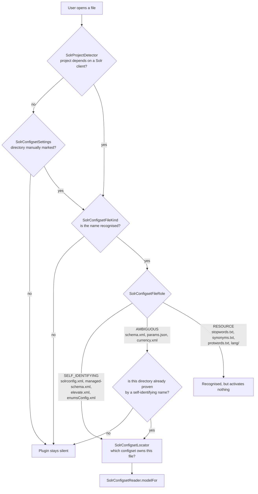
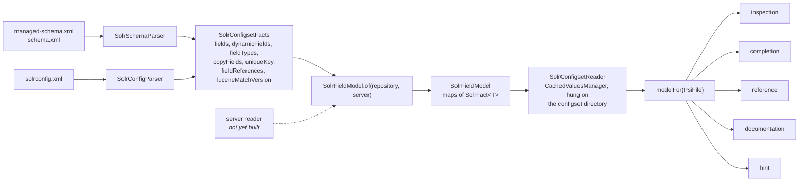

# Code organization

Where a change goes, and what the package you put it in will not let you do.

This is the human-facing account. The API reference renders the same structure from KDoc — run
`./gradlew dokkaGenerate` and open `build/dokka/html`, or download the `api-documentation` artifact
from any CI run. [`specs/plans/0002-solr-intellij-plugin-plan.md`](../specs/plans/0002-solr-intellij-plugin-plan.md)
owns which of it is built — **do not infer status from this file**.

## The organising principle

Packages are organised **by feature, and by feature again inside**.

The specification describes three surfaces — configuration files, a live server, and Java/Kotlin
code — unified by one model of what fields exist and what they can do. Those surfaces are the top
level. Within a surface, each package is **one capability, not one layer**: there is no `service`
package, no `util`, no `impl`. A capability owns its own parsing-to-presentation slice.

`org.apache.solr.ide.model` is the single exception, and it earns the exception twice over. It is
what both surfaces read, so filing it under either would be wrong. And it is the only package with
no IntelliJ types anywhere in it, which is what lets the correctness-critical code be tested as a
plain unit test over a string rather than inside a running IDE.

New packages are created when they have a file to hold, not in advance.

## Where does my change go?

| If you are changing… | It goes in | Read first |
|---|---|---|
| What a configset *means* — fields, types, analyzer chains, what a field can match | `model` | [Extend the field model](how-to/extend-the-field-model.md) |
| How a file is read into that meaning | `configset.parsing` | [Extend the field model](how-to/extend-the-field-model.md) |
| Whether the plugin runs at all, or which configset owns a file | `configset.activation` | The [activation decision](#the-activation-decision) below |
| Something the editor reports as wrong | `configset.inspection` | [Add an editor feature](how-to/add-an-editor-feature.md) |
| What is offered at the caret | `configset.completion` | [Add an editor feature](how-to/add-an-editor-feature.md) |
| Ctrl-click, Find Usages, rename | `configset.reference` | [Add an editor feature](how-to/add-an-editor-feature.md) |
| What a hover explains | `configset.documentation` | [Add an editor feature](how-to/add-an-editor-feature.md) |
| Something shown inline in the editor without being asked | `configset.hint` | [Add an editor feature](how-to/add-an-editor-feature.md) |
| Reaching a running Solr, or remembering how to | `server` | Nothing talks to a server yet |
| A user-visible string | `org.apache.solr.ide` (`SolrBundle`) | — |

If your change spans two of these, that is usually correct and not a smell — an inspection reads the
model and reports through the platform, and both halves belong where they are. What is a smell is a
capability package importing another capability package. They share through `model` and
`configset.parsing`, never through each other.

## Rules that hold across every package

These are the constraints a change can silently violate. None of them is enforced by a build gate.

**Nothing in `model` imports an IntelliJ type.** This is what makes the model testable without a
fixture, and it is load-bearing rather than stylistic — roughly a third of the test suite is plain
JUnit 4 precisely because of it. One platform import costs that.

**Nothing on the editor path contacts a server.** Configset editing works with no connection
configured at all. `server` is unreachable from any editor feature.

**Detection runs on every file the user opens**, so its signals stay cheap, local, and cached. A new
detection signal that reads a file, resolves a dependency graph, or walks a directory tree is on the
wrong side of that line.

**Every contribution declares itself dumb-aware, and that is a promise about data sources.** Nothing
in this plugin reads an index — the model is parsed from the configset's own text — so features work
while the project is still indexing, which is exactly when a reader is most likely to be opening
files for the first time. A future feature that *does* read an index must drop the declaration or
guard with `DumbService`. No build gate catches it if it doesn't.
[`platform-mechanisms.md`](platform-mechanisms.md) carries the reasoning.

**The plugin edits configuration files directly and never refuses a write.** Solr's default configset
carries a banner saying the file is managed by the Schema API and should not be hand-edited; the
plugin edits it anyway, because it is a source file in your repository. If you find code or docs
asking whether a write is *allowed*, it predates this decision and should go.

## The activation decision

Two gates, in order, and silence is the designed outcome outside a Solr project.

`SolrProjectDetector` matches a Solr client **by artifact id, never by version** — `solr-solrj`, or a
wrapper that carries it such as Spring Data Solr, Camel, or the Quarkus extensions. That is a fact
rather than an inference, which is why it replaced the directory heuristics an earlier revision used.

The role tiers exist because file names prove different amounts. `solrconfig.xml` carries Solr's own
vocabulary and stands alone. `schema.xml` is shared with far too many other things — an unrelated XSD
named `schema.xml` must stay untouched — so it counts only inside a directory a self-identifying name
has already proven. Resources such as `stopwords.txt` are too common to prove anything and never
activate anything, though they are recognised once inside a known configset.

`SolrConfigsetLocator` caches its answer, because this runs every time a file is opened.

A manually marked root in `SolrConfigsetSettings` bypasses the outer gate. That makes the override
**load-bearing rather than a convenience**: a repository of bare configsets has no build file, so no
dependencies to detect, and the manual root is the only way it activates at all. Those settings
persist to the shared `solr.xml` rather than workspace-local storage, because a marked root is a fact
about the project rather than about one machine — so paths are collapsed through `PathMacroManager`
on write (`$PROJECT_DIR$/core/conf`) and expanded on read. Treat `state.manualConfigsetRoots` as
storage-form only; read `manualRoots` for usable absolute paths.

## From files to the model

Every editor feature asks the same question, and it is deliberately not a question any of them
answers for itself.

`SolrConfigsetReader.modelFor(PsiFile)` lives in `parsing` rather than beside any one feature,
because otherwise four features would import the fifth.

The parsers are **pure functions from text to facts**, using the JDK's DOM rather than IntelliJ's XML
PSI, which is what lets them be tested without an IDE. External entities and doctypes are refused: a
cloned repository is not trusted input, and entity resolution would run while the user is merely
opening a file.

The model is derived from PSI, so **unsaved edits count** — PSI reflects the editor's buffer long
before anything reaches disk — and the model cannot disagree with the PSI its consumers are visiting.

The cache is the platform's `CachedValuesManager`, hung on the configset directory rather than held
in a map this plugin owns, so its lifetime is the directory's and a configset that stops existing
takes its cache with it. Its dependency list is the two source files **plus the VFS structure
count**: the first rebuilds the model when this schema changes and leaves it alone when unrelated
code does, the second notices a `solrconfig.xml` that appears later. Neither half can be dropped, and
the reflex choice of `PsiModificationTracker.MODIFICATION_COUNT` is a performance regression here —
[`platform-mechanisms.md`](platform-mechanisms.md) records why.

`SolrConfigsetScanner` answers the question the per-file locator cannot: which configsets does this
*project* contain. It walks content roots and prunes build output and dependency trees, so it is not
an editor-path operation.

## The packages

### `org.apache.solr.ide`

Plugin-wide infrastructure. Currently the localization bundle, `SolrBundle`. Feature code lives in
subpackages.

### `org.apache.solr.ide.model`

What the plugin knows about a configset's fields, as data — and the one package that is not a
feature.

`SolrFieldModel` exists to merge a repository half with a server half, so it belongs to both surfaces
and filing it under either would be wrong. A fact is a `SolrFact` holding both halves and reporting
how they relate (`SolrAgreement`), rather than a value with the disagreement already resolved away.
Where only one can be shown the repository wins, because the editor's job is to reason about the file
in front of the user; the difference is surfaced rather than hidden. The server half is empty until
the server reader lands.

`SolrMatchAnalysis` derives what a field can actually match from its index-time analyzer chain. The
factories that decide it are named in code rather than read from the generated catalog, because that
set defines the semantics rather than enumerating what exists. `SolrMatchCapability` names the
*mechanism* behind partial matching rather than asserting a boolean — a wildcard query works against
any indexed field, so the useful claim is about efficiency — and carries a confidence flag, because a
wrong claim about what a field matches is worse than no claim.

`SolrClassCatalog` reads the catalog generated at build time from every supported Solr line's
artifacts — the classes a configset may name in a `class` attribute, in four kinds
(`SolrClassKind`): field types, tokenizers, token filters and char filters, each with the attribute
names it reads. Generated rather than written down because the list runs to roughly 170 entries per
line and changes between lines; see the `generateSolrCatalog` block in `build.gradle.kts`.

### `org.apache.solr.ide.configset.activation`

Deciding whether the plugin runs at all, and against which configset. See [the activation
decision](#the-activation-decision).

### `org.apache.solr.ide.configset.parsing`

Reading a configset off disk into the model. See [from files to the model](#from-files-to-the-model).

### `org.apache.solr.ide.configset.inspection`

Reporting references that go nowhere: a dangling `copyField`, a field naming an undeclared type, and
— crossing the file boundary nothing else checks — a handler parameter in `solrconfig.xml` naming a
field the schema never declares.

**The clean fixtures matter more than the flagged ones.** Solr configuration is full of syntax that
resembles a field name: `fl` legitimately holds `score`, `*`, `[docid]`, `max(price,0)` and
`alias:name`, and a glob `copyField` source is a pattern whose matches the schema alone cannot
determine. A warning on a correct file is what gets a plugin uninstalled. `SolrInspections` is where
that requirement gets teeth.

Each reference inspection offers the valid alternatives as a quick-fix, ranked by edit distance
because the common cause is a typo, and capped because a schema with eighty fields must not answer
one typo with eighty menu items. The inspection computed that set in order to decide; discarding it
and leaving the reader to find it is the difference between an editor that helps and one that
complains.

### `org.apache.solr.ide.configset.completion`

Offering the values an attribute can legally take — and answering two questions, not one. *What value
goes here*, and *what may I write at all*: the elements legal at the caret, and the attributes an
element accepts minus those it already carries. The second matters more to a reader who has not
learned the vocabulary, since a name that appears in no existing file is a name they will never meet.

**Only closed sets are completed.** Where any value is legal, nothing is contributed and the
platform's own behaviour is left alone: a list implies that the values not on it are wrong, so a
partial list in an open-ended position is worse than none. `true`/`false` are marked with the value
Solr would use if the attribute were absent — except where that default depends on the field type, in
which case neither is marked, because claiming one would assert something Solr does not.

### `org.apache.solr.ide.configset.reference`

Turning the strings that hold a configset together into references the editor understands.

References are **soft**. An unresolved hard reference draws a warning from the platform, which would
duplicate what the inspections already report and say less while doing it, in the platform's
vocabulary rather than Solr's.

A glob is followed only as far as it is written. `copyField dest="*_t"` and `dynamicField
name="*_t"` spell the same pattern literally, so landing on the declaration is exact; resolving
instead to a concrete field the pattern would match would invent a target, since which fields those
are depends on the documents indexed rather than on the schema. That is the same line the inspections
draw when they stay silent on globs.

`SolrSchemaPsi` exists because the model holds no PSI: it can say a field type exists but not where
it was written, and navigation needs the second answer.

### `org.apache.solr.ide.configset.documentation`

Quick documentation on a schema element, on a field, and on its type.

Every position a reader would try answers: the element, a property attribute, and a value inside one.
That matters more than it sounds — the resolved property table is the one thing here no external
documentation can supply, and it was once reachable only with the caret inside a field's `name`
quotes, so hovering the element or hovering `omitNorms` itself returned something less useful than
the thing sitting one gesture away.

It answers what the Reference Guide cannot: not what `omitNorms` means in general, but what it is
*for this field in this schema*, and whether that value came from the field, from its type, or from
Solr's default. Some defaults genuinely depend on the field type, and those are reported as such
rather than given a plausible value. `SolrSchemaElements` holds what each element is and what *this*
one does where the model can say.

Documentation links to the Reference Guide rather than copying it, at the version the configset
declares. Links are page-level — anchors drift between releases and field types have no per-class
anchor at all — and **nothing on the editor path fetches a URL**.

### `org.apache.solr.ide.configset.hint`

Showing what each field matches, inline beside its declaration.

An inlay rather than a tooltip on purpose: a user who does not already suspect their field cannot
match a prefix will never hover over it to find out. Nothing is shown where the analysis is not
confident, or where a field names a type the configset does not declare — a wrong claim here is worse
than a missing one, and this is the output most likely to be quoted back.

### `org.apache.solr.ide.server`

Talking to a live Solr server, and remembering how to reach one. Currently connection settings only.

The distinction that governs this package is **where its state may be written**. A configset root is a
fact about the project and is shared; a connection is a fact about one developer's machine.
Connection definitions therefore persist to the per-user workspace file and their credentials to the
IDE's PasswordSafe, never to a file that could be committed.

Nothing in this package may be reached from the editor path.

## Where later work goes

- `org.apache.solr.ide.configset.*` — the configuration-files surface, split by capability.
- `org.apache.solr.ide.server` — the live-server surface, and the HTTP client when it lands.
- Recognizers for Java and Kotlin code get their own surface when the first one is written.

Packages are created when they have a file to hold, not before.
