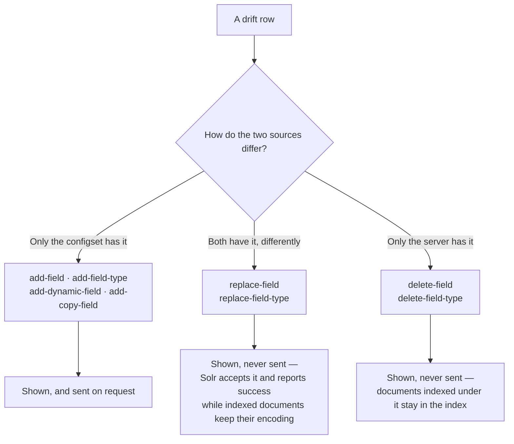
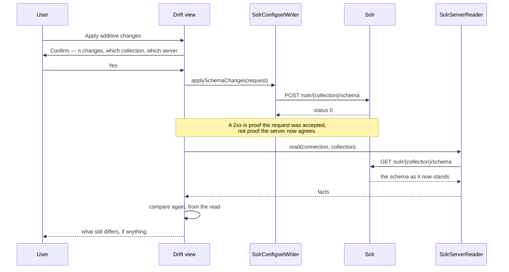

# Applying drift through the Schema API, and refusing to

## Problem

The drift view could show that a configset and a collection disagree and do nothing about it.
Closing a difference meant leaving the IDE, and the obvious next feature — a button that sends the
Schema API command matching each row — is one this plugin must only half build.

Solr's Schema API will accept a command that silently corrupts an index, and report success.

## What Solr actually does

Verified against Solr 10.0.0 in SolrCloud mode. A field declared `string`, holding two indexed
documents — one with `"abc"`, one with `"42"` — changed to `pint`:

```
POST /solr/books/schema  {"replace-field":{"name":"code","type":"pint",...}}
  → responseHeader.status 0, no error
```

Afterwards:

| Request | Result |
|---|---|
| `q=code:42` (a document holds exactly that) | `numFound: 0` — **silently wrong** |
| `q=code:abc` | HTTP 400 `Invalid Number: abc for field code` |
| `q=*:*&fl=id,code` | **HTTP 500** `AssertionError: Unexpected state` |

The third is the one worth pausing on. Asking for the field in `fl` fails the whole request — for
every document, including the ones that never carried it. A user who applied that change would find
unrelated queries dead, with nothing in Solr's answer to the write pointing at why.

Only a reindex makes the schema true again, and this plugin cannot reindex and must not imply it
can.

## Decision

**Every row shows the request that would close it. Only additive rows offer to send it.**



An additive command is safe in the sense that matters: a document already indexed simply lacks the
new thing, and nothing already written becomes wrong.

**A disabled button with a tooltip is a weak answer to "why not".** Database Tools sets the better
precedent — comparing two schemas there produces reviewable DDL rather than a silent mutation, so
what the tool would do is something you read before deciding. Selecting any row here shows its
payload; a refused row shows the reason first and the payload under it, so a reader meets the
warning before the JSON they might otherwise copy.

That turns the asymmetry from an omission into information. The user sees exactly what the plugin
declines to do, in Solr's own vocabulary, and is left able to run it themselves against a collection
they are prepared to reindex — which is their decision, not this plugin's to prevent.

## Field types are offered, though the requirement named three commands

[FR-14](../../../../specs/0002-solr-server-integration.md) lists `add-field`, `add-dynamic-field` and
`add-copy-field`. `add-field-type` passes the same test — a type nothing uses cannot invalidate a
document — and omitting it would break the others:

```
POST /schema  {"add-field":{"name":"price","type":"my_missing_type",...}}
  → 400  "Field 'price': Field type 'my_missing_type' not found."
```

A run that offered a field and not the type it names would fail on a difference it had just claimed
it could close. So the command is offered, and a request orders types before the fields that use
them — Solr applies a request's commands in order, verified with one type and two fields using it in
a single request.

## What a run looks like



The re-read is not defensive habit. The upload path found the same rule the hard way: a configset
lacking `_version_` uploads with `status: 0`, appears in `action=LIST`, and Solr then refuses to
build a collection from it. Reporting from the write's own answer would show a deployment that had
not happened.

## Consequences

- The rule about which commands are safe lives in `SolrSchemaApi` and nowhere else. `SolrConfigsetWriter`
  sends whatever it is handed; a writer that also decided would be a second place for that judgement
  to live and a second place to get it wrong.
- A comparison containing nothing but type changes offers no button at all. That is the honest
  reading of "only additive changes get the second action", and it is what the enablement asserts.
- Four tests fail if a `replace-field` is ever made applicable, including one asserting it can never
  reach a request whatever else is in it.
