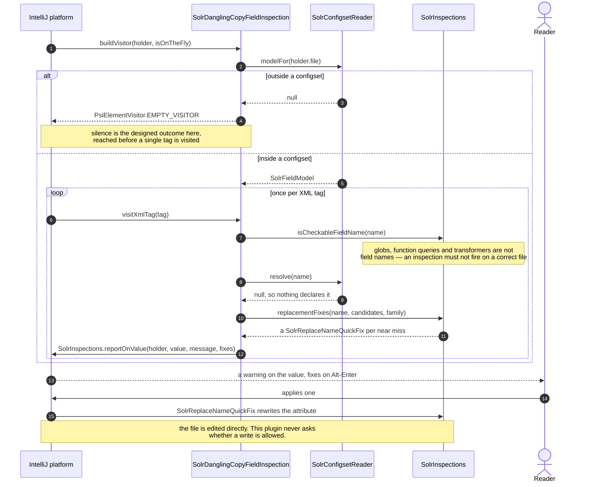
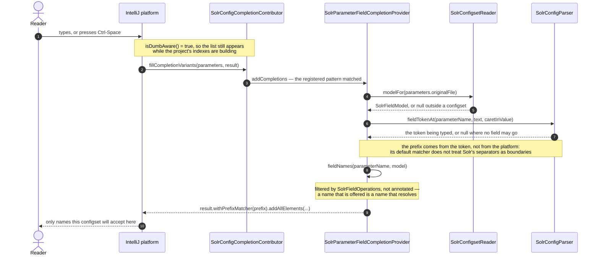
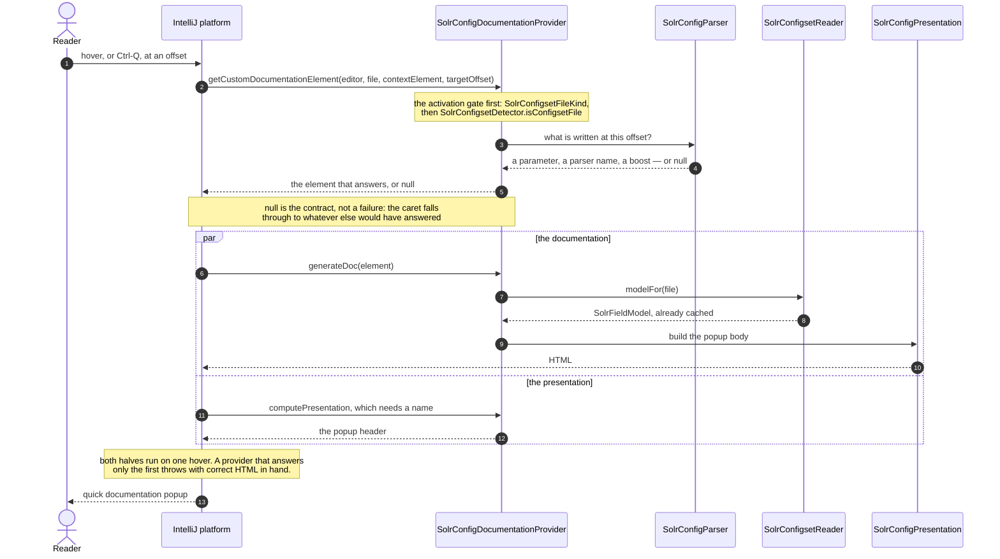

# Add an editor feature

> **Who this is for.** A Java engineer who has read the plugin development tutorial (or already
> knows the platform) and wants the concrete, repository-specific checklist for landing one new
> inspection, completion, reference, or documentation feature.
> **Read first:** [Glossary](../glossary.md) if Solr or IntelliJ Platform terms are new ·
> [The plugin development tutorial](../modern-intellij-plugin-development.md) for the platform
> concepts this guide assumes.

This guide assumes you know roughly what a `LocalInspectionTool` or a `CompletionContributor` is. If
you do not, [the plugin development tutorial](../modern-intellij-plugin-development.md) teaches the
platform from scratch and this guide will make more sense afterwards. What follows is what is
specific to *this* repository: which files you touch, in what order, and what will reject the change.

The first half traces one real feature end to end. The second half is four short deltas — once you
have seen the spine, each other capability is a small variation on it.

---

## The walkthrough: an inspection

We will follow `SolrUnknownFieldTypeInspection`, which reports a `field` whose `type` names a
[field type](../glossary.md#field-type) the [configset](../glossary.md#configset) does not declare.
It is sixty-one lines of Kotlin and it reaches into seven other places. That fan-out is the thing
worth learning; the Kotlin is the easy part.

Here is the fan-out as one sequence, using `SolrDanglingCopyFieldInspection` — the same spine, and it
carries a quickfix, so the whole round trip is visible.



The two branches out of `modelFor` are the shape every feature in this guide repeats: a null model
means return something inert, and it is checked once in `buildVisitor` rather than per tag.

### 1. The inspection class

`src/main/kotlin/org/apache/solr/ide/configset/schema/inspection/SolrUnknownFieldTypeInspection.kt`

```kotlin
class SolrUnknownFieldTypeInspection : LocalInspectionTool() {

    override fun buildVisitor(holder: ProblemsHolder, isOnTheFly: Boolean): PsiElementVisitor {
        val model = SolrConfigsetReader.getInstance(holder.project).modelFor(holder.file)
            ?: return PsiElementVisitor.EMPTY_VISITOR
        return object : XmlElementVisitor() {
            override fun visitXmlTag(tag: XmlTag) { /* ... */ }
        }
    }
}
```

The [KDoc](../glossary.md#kdoc) on the class is not optional — see
[the documentation gate](#the-documentation-gate). Write it saying *why the defect matters*, not what
the code does. The real one explains that Solr refuses
to load a core with an unknown field type, so this fails at deploy time rather than while the file is
being written.

### 2. Declare dumb-awareness — and mean it

```kotlin
override fun isDumbAware(): Boolean = true
```

**This is a promise about data sources, not a performance tweak.** It says the feature works while
the project is still indexing, which is true here because the model is parsed from the configset's
own text and nothing consults an index. The platform's default is to skip contributions during
[dumb mode](../glossary.md#dumb-mode), which would withhold a working feature exactly when a reader
is most likely to be opening files for the first time.

> **In Java terms.** Dumb mode is what a search index looks like mid-import: the database is still
> being built, so queries against it are refused until it is ready, rather than answered with a
> partial or stale result. Declaring `isDumbAware() = true` says "I never query that index" — it is
> only honest when it is true, because the platform takes your word for it.

If you ever add a feature that *does* read an index, drop the declaration or guard with
`DumbService`. No build gate catches this.

**Which mechanism you use depends on the [extension point](../glossary.md#extension-point)**, and
this repository uses both:

| Extension point | How it declares |
|---|---|
| `LocalInspectionTool`, `CompletionContributor` | `override fun isDumbAware(): Boolean = true` |
| [Documentation provider](../glossary.md#documentation-provider), [inlay hint](../glossary.md#inlay-hint) provider | implement the `DumbAware` marker interface |

Copy whichever the neighbouring class of the same kind uses. [`platform-mechanisms.md`](../platform-mechanisms.md)
carries the reasoning behind the rule.

### 3. Reach the model, and let it gate you

```kotlin
val model = SolrConfigsetReader.getInstance(holder.project).modelFor(holder.file)
    ?: return PsiElementVisitor.EMPTY_VISITOR
```

`modelFor(PsiFile)` returns null when the file is not part of a configset the plugin recognises. That
null **is** the activation check — you do not write your own. Returning `EMPTY_VISITOR` is what makes
the feature inert in every other XML file in the project, and doing it first means the rest of your
code can assume it has a model.

Never build your own cache around this. The reader already caches through the platform's
`CachedValuesManager`, hung on the configset directory; a second cache in front of it would be both
redundant and wrong when files change.

### 4. Use the shared inspection helpers

`SolrInspections` is where the zero-false-positive requirement gets teeth. Three things live there,
and you almost certainly want all three:

```kotlin
SolrInspections.reportOnValue(holder, value, message, fixes)
```

Reports on the text *inside* the attribute's quotes. An attribute value element spans its quotes, so
registering on the element underlines `"manufacturer"` rather than `manufacturer`. Small, and it
reads as sloppiness in the one place the plugin is asking to be believed.

```kotlin
SolrInspections.replacementFixes(wrong, candidates, familyText)
```

[Quick-fixes](../glossary.md#quick-fix) offering each valid candidate, ranked by edit distance
because the overwhelmingly common cause is a typo, and capped at six because a schema with eighty
fields must not answer one typo with eighty menu items. **The
[inspection](../glossary.md#inspection) already computed the valid set in order to decide** —
discarding it and leaving the reader to find it is the difference between an editor that helps and
one that complains.

```kotlin
SolrInspections.isCheckableFieldName(name)
```

Excludes the names Solr answers for itself — `score`, `_version_`, `_root_` — and anything containing
a wildcard, which is a pattern rather than a [reference](../glossary.md#reference). Use it anywhere
you are about to flag a field
name.

**This is where reviews get stuck.** Solr configuration is full of syntax that looks like a field
name without being one: `fl` legitimately holds `score`, `*`, `[docid]`, `max(price,0)` and
`alias:name`. A warning on a correct file is what gets a plugin uninstalled. Before writing the
flagged fixture, write the clean ones.

### 5. Bundle keys

`src/main/resources/messages/SolrBundle.properties`

Every user-visible string goes here. The inspection needs four:

```properties
inspection.group=Solr
inspection.fieldType.displayName=Unknown field type
inspection.fieldType.unknown=Solr: no field type named ''{0}'' is declared in this configset
quickfix.fieldType.family=Use a declared field type
```

Note the **doubled single quotes** in the message with a `{0}` placeholder. That is `MessageFormat`,
not Kotlin — a single `'` there would swallow the placeholder and print the literal text `{0}`.

Read them with `SolrBundle.message("inspection.fieldType.unknown", typeName)`.

### 6. The description HTML

`src/main/resources/inspectionDescriptions/SolrUnknownFieldType.html`

**The filename must exactly equal the `shortName` you register in `plugin.xml`.** Get it wrong and
there is no build error — the Settings panel simply shows a blank description where the explanation
should be. Nothing catches this but looking.

The content is what a user reads when deciding whether to enable the inspection, so it explains the
consequence and gives an example:

```html
<html>
<body>
Reports a <code>field</code> or <code>dynamicField</code> whose <code>type</code> names a field type
the configset does not declare.
<p>
  Solr refuses to load a core with an unknown field type. The mistake is easy to make while editing,
  because generic word completion will happily offer any word already present in the file — including
  attribute names such as <code>stored</code>.
</p>
</body>
</html>
```

### 7. Register it in `plugin.xml`

[`src/main/resources/META-INF/plugin.xml`](../glossary.md#pluginxml)

```xml
<localInspection
    language="XML"
    shortName="SolrUnknownFieldType"
    bundle="messages.SolrBundle"
    key="inspection.fieldType.displayName"
    groupBundle="messages.SolrBundle"
    groupKey="inspection.group"
    enabledByDefault="true"
    level="WARNING"
    implementationClass="org.apache.solr.ide.configset.schema.inspection.SolrUnknownFieldTypeInspection"/>
```

`shortName` is the coupling to the HTML file in step 6. `key` and `groupKey` resolve against the
bundle in step 5.

**`level="WARNING"`, not `ERROR`.** Every inspection here is a warning on purpose: the plugin's model
of a half-typed file is not authoritative enough to claim a hard error, and an error on a file the
user is midway through editing is worse than a warning on the same file. If you think yours warrants
`ERROR`, that is a discussion to have in the PR rather than a default to take.

Add a comment above the registration if the entry is not self-explanatory. The existing blocks
explain *why* they are shaped the way they are, and that convention is worth keeping.

### 8. The test

`src/test/kotlin/org/apache/solr/ide/configset/schema/inspection/SolrUnknownFieldTypeInspectionTest.kt`

```kotlin
class SolrUnknownFieldTypeInspectionTest : SolrConfigsetTestCase() {

    private fun check(body: String) {
        myFixture.enableInspections(SolrUnknownFieldTypeInspection())
        myFixture.configureByText("managed-schema.xml", schema.replace("BODY", body))
        myFixture.checkHighlighting(true, false, false)
    }

    fun testAFieldNamingAnUndeclaredTypeIsFlagged() {
        check("""<field name="sku" type="<warning descr="Solr: no field type named 'stored' is declared in this configset">stored</warning>"/>""")
    }

    fun testFieldsNamingDeclaredTypesAreClean() {
        check("""<field name="sku" type="string"/><field name="body" type="text_general"/>""")
    }
}
```

Four things are doing work here:

- **`SolrConfigsetTestCase`, not [`BasePlatformTestCase`](../glossary.md#baseplatformtestcase).** It
  puts a Solr client on the fixture's classpath, without which the outer activation gate would reject
  the file and your test would pass for the wrong reason — asserting nothing fires against a project
  the plugin is correctly ignoring.

  > **In Java terms.** `BasePlatformTestCase` boots a real, if headless, IDE for the test — closer to
  > `@SpringBootTest` than to a plain unit test, and priced accordingly. `SolrConfigsetTestCase` is
  > this repository's subclass of it, the way a project base test class wires in the fixtures every
  > `@SpringBootTest` in the codebase needs.
- **`testSomething()` naming.** These are JUnit 3-style and discovered by the prefix, not by `@Test`.
- **`checkHighlighting` fails on unmarked highlights too**, which is what makes the clean cases real
  assertions rather than decoration.
- **The expected message is inline in the fixture**, so a message change breaks the test. That is
  intentional; user-visible strings are behaviour.

Write a `testNothingIsReportedOutsideASolrProject` case too — `givenNoSolrOnTheClasspath()` is on the
base class for exactly this.

[Testing and the build gates](testing-and-the-build-gates.md) has the full picture.

### The documentation gate

Before you push: **every public declaration needs KDoc**, or `./gradlew build` fails naming the
declaration. That includes the class, any public function, and any public property. Overrides of
platform methods are still public declarations.

Write it explaining the decision, not the mechanics. The real `isDumbAware` override carries three
sentences about why nothing here consults an index — which is the thing a future reader needs and
cannot recover from the code.

---

## The deltas

Same spine every time: reach the model through `modelFor`, return something inert when it is null,
declare dumb-awareness, register in `plugin.xml`, put strings in `SolrBundle`, test with a fixture.
Here is what differs.

### Completion

`configset/schema/completion/SolrSchemaCompletionContributor.kt` — extends `CompletionContributor`,
registered as `<completion.contributor language="XML">`, declares `override fun isDumbAware()`.

The contributor registers *providers* against PSI patterns in its `init` block; each provider extends
`CompletionProvider<CompletionParameters>` and implements `addCompletions`. There are two in the file:
one for attribute values, one for the schema's own vocabulary.

**The rule that will get your change rejected: only complete closed sets.** Where any value is legal,
contribute nothing and leave the platform's own behaviour alone. A completion list implies that the
values not on it are wrong, so a partial list in an open-ended position is worse than no list. Where
you offer `true`/`false`, mark the value Solr would use if the attribute were absent — except where
that default depends on the field type, in which case mark neither, because claiming one would assert
something Solr does not.

The `solrconfig` side shows the other thing completion has to get right — where the prefix comes
from:



Steps 7 and 8 are the ones to copy. Leaving the prefix to the platform looks like it works and then
filters a correctly built list down to nothing in `sort=id asc,`, because its default matcher reads
an identifier back from the caret and does not know Solr's separators.

No description HTML, no `shortName`.

### References and navigation

`configset/schema/reference/SolrSchemaReferenceContributor.kt` — extends `PsiReferenceContributor`,
registered as `<psi.referenceContributor language="XML">`, implements `registerReferenceProviders`.

You write three things rather than one: a `PsiReferenceProvider` returning references for a matched
element, a `PsiReference` implementation that knows how to `resolve()`, and a PSI pattern to bind
them. `SolrCopyFieldReference` and `SolrFieldTypeReference` are the two worked examples.

Three repository-specific rules:

- **References are soft.** An unresolved hard reference draws a platform warning that duplicates what
  the inspections already report, and says less while doing it, in the platform's vocabulary rather
  than Solr's.
- **`getVariants()` returns empty.** Completion is the completion package's job; a reference that
  also offers variants would produce a second, differently-shaped list.
- **Follow a glob only as far as it is written.** `copyField dest="*_t"` resolves to the
  `dynamicField` that spells the same pattern, never to a concrete field the pattern might match —
  which fields those are depends on the documents indexed, not on the schema.

`SolrSchemaPsi` is how you get from a model answer back to PSI. The model holds no PSI: it can say a
field type exists but not where it was written, and navigation needs the second answer.

### Quick documentation

`configset/schema/documentation/SolrSchemaDocumentationProvider.kt` — extends
`AbstractDocumentationProvider` **and implements `DumbAware`** (marker interface, not an override),
registered as `<lang.documentationProvider language="XML">`.

Three methods matter. `getCustomDocumentationElement` decides *what* the caret is on — this is the
one people forget, and getting it wrong means hovering an element returns something less useful than
hovering one gesture away. `generateDoc` builds the HTML. `getUrlFor` supplies the external link.



**The `par` block is the trap.** One hover runs both halves, and only the first is what a test
calling `generateDoc` exercises. If `getCustomDocumentationElement` returns something synthetic — a
`FakePsiElement` standing in for a range inside a text node — it must supply a name, or the platform
refuses to present the target and the popup dies with its HTML already built and correct. Test
through `IdeDocumentationTargetProvider` so both halves run.

Repository-specific: **link to the Reference Guide, never copy it**, at the version the configset
declares. Links are page-level, because anchors drift between releases and field types have no
per-class anchor at all. And **nothing on the editor path fetches a URL** — you supply a link, you do
not follow it.

`SolrSchemaElements` holds what each schema element is; add to it rather than embedding prose in the
provider.

### Inlay hints

`configset/schema/hint/SolrMatchInlayHintsProvider.kt` — implements `InlayHintsProvider` and `DumbAware`,
with a collector implementing `collectFromElement`.

Its registration is the most involved of the five, because it is the only one with a user-facing
toggle:

```xml
<codeInsight.declarativeInlayProvider
    language="XML"
    providerId="solr.match.capability"
    bundle="messages.SolrBundle"
    nameKey="inlay.matchCapability.name"
    group="OTHER_GROUP"
    isEnabledByDefault="true"
    implementationClass="..."/>
```

`providerId` identifies it in settings, and `nameKey` is what the user sees in the inlay-hints
settings tree. The other four contributors have no such toggle.

Repository-specific: **say nothing when unsure.** An inlay is unsolicited — it appears without the
user asking — so a wrong claim is worse than a missing one, and this is the output most likely to be
quoted back at you. The existing provider stays silent where a field names a type the configset does
not declare; where the analysis is not confident it drops the match half and shows the storage shape
alone.
