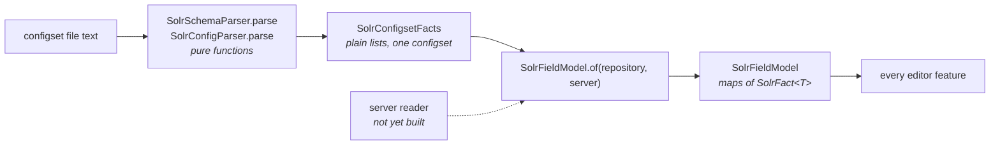

# Extend the field model

`org.apache.solr.ide.model` is what every feature reads, and the only package with no IntelliJ types
in it. This guide covers adding a new fact to it: where the fact enters, how it reaches a feature,
and the two rules that make the package worth having.

## The two rules

**No IntelliJ types. Ever.**

This is load-bearing rather than stylistic. Eleven of the thirty-two test files in this repository are
plain JUnit 4 — no fixture, no headless IDE, no second of wall-clock per test — and they can be
because the code they test imports nothing from the platform. One platform import costs that, for
every test in the file and every test written against it afterwards.

It also means the model is testable as a function over a string, which matters most for the code
where being wrong is expensive. `SolrMatchAnalysis` is the claim the demo puts in front of a room and
invites the audience to challenge; it is tested against every canonical Solr field type because it
can be.

**A fact holds both halves.**

The model exists to merge a repository half with a server half. `SolrFact<T>` carries
`repository: T?` and `server: T?` and reports how they relate through `SolrAgreement`, rather than
being a value with the disagreement already resolved away. `effective` prefers the repository,
because the editor's job is to reason about the file in front of the user — but the difference is
surfaced rather than hidden, because showing where your configuration and your deployed server
disagree is a feature the plugin is specified to have.

The server half is empty until the server reader lands. Write new facts as `SolrFact<T>` anyway; a
value that resolves the question away now will have to be unpicked later.

## The pipeline



Adding a fact means touching each stage in order. Skipping one is the usual bug: a parser that reads
something no `SolrConfigsetFacts` field carries throws the value away silently.

### 1. The type

`model/SolrSchemaTypes.kt` holds the vocabulary — `SolrField`, `SolrFieldType`, `SolrDynamicField`,
`SolrCopyField`, `SolrAnalyzerChain`, `SolrAnalyzerComponent`, `SolrFieldReference`. Add a `data
class` here, or a property to an existing one.

Every public property needs KDoc. Say what the value means in Solr's terms, not what the type is.

### 2. The parser

`configset/parsing/SolrSchemaParser` and `SolrConfigParser` are `object`s with a single entry point:

```kotlin
fun parse(xml: CharSequence): SolrConfigsetFacts
```

**They are pure functions from text to facts**, using the JDK's DOM rather than IntelliJ's XML PSI.
That is what lets them be tested without an IDE, and it is why the signature takes a `CharSequence`
rather than a `PsiFile`. Keep it that way — a parser that needs PSI has moved into the platform and
takes the model's testability with it.

External entities and doctypes are refused. A cloned repository is not trusted input, and entity
resolution would run while the user is merely opening a file. Anything you add that resolves an
external resource needs the same treatment.

### 3. `SolrConfigsetFacts`

```kotlin
data class SolrConfigsetFacts(
    val fields: List<SolrField> = emptyList(),
    val dynamicFields: List<SolrDynamicField> = emptyList(),
    val fieldTypes: List<SolrFieldType> = emptyList(),
    val copyFields: List<SolrCopyField> = emptyList(),
    val uniqueKey: String? = null,
    val fieldReferences: List<SolrFieldReference> = emptyList(),
    val luceneMatchVersion: String? = null,
)
```

One configset's raw parse output, as plain lists. Default every new property so that a parser which
does not produce it still compiles.

### 4. `SolrFieldModel`

`SolrFieldModel.of(repository, server)` merges the two halves. Lists become maps keyed by name, and
values become `SolrFact<T>`. Add your fact to the constructor and to `of`.

This is also where derived queries live — `typeOf`, `resolve`, `copyFieldsFrom`. If your fact needs
interpreting rather than just carrying, the interpretation belongs here or in its own model file, not
in the feature that first needed it. Otherwise the second feature to need it will import the first.

### 5. The cache dependency — the step that is easy to miss

`SolrConfigsetReader` caches a model per configset through the platform's `CachedValuesManager`, hung
on the configset directory:

```kotlin
CachedValuesManager.getCachedValue(directory) {
    // ...
    CachedValueProvider.Result.create(
        model,
        sources.map { it.file } + VirtualFileManager.VFS_STRUCTURE_MODIFICATIONS,
    )
}
```

The dependency list is **the source files plus the VFS structure count**, and neither half can be
dropped. The files rebuild the model when this schema changes and leave it alone when unrelated code
does. The structure count notices a `solrconfig.xml` that appears later, which no file dependency can,
because you cannot depend on a file that does not exist yet.

**If your fact comes from a file the reader does not currently read, that file must join `sourcesOf`
so it becomes a cache dependency.** Miss this and the model goes stale in a way no test catches by
accident: it will be correct on first read and wrong after an edit.

The reflex choice of `PsiModificationTracker.MODIFICATION_COUNT` is a performance regression here —
it invalidates on every PSI change anywhere in the project.
[`platform-mechanisms.md`](../platform-mechanisms.md) records why, and it is worth reading before
touching this.

Because the model is derived from PSI, **unsaved edits count**. PSI reflects the editor's buffer long
before anything reaches disk, so the model cannot disagree with the PSI its consumers are visiting.

## Testing it

Plain JUnit 4, `@Test`, backtick names. No fixture:

```kotlin
class SolrMatchAnalysisTest {

    @Test
    fun `an unanalyzed type matches the whole value, case-sensitively`() {
        // ...
    }
}
```

A `testSomething()` name here would still run, but it reads as a claim that the test needs a platform
it does not.

Test the parser against text and the model against constructed facts, separately. The parser's job is
"does this XML produce these facts"; the model's is "given these facts, what follows". Combining them
makes both harder to read and neither easier to trust.

See [testing and the build gates](testing-and-the-build-gates.md) for the full conventions.

## What does not go here

- **Anything needing a `Project`, a `PsiFile`, or a `VirtualFile.`** That is `configset.reading`, or the aspect's own `parsing` package.
- **Anything reading a Solr server.** That is `server`, and it is unreachable from the editor path.
- **Presentation.** How a fact is worded for a user belongs in the feature that shows it —
  `SolrFieldPresentation` and `SolrSchemaElements` are in `configset.schema.documentation` for that reason.
  The model says what is true; features decide how to say it.
