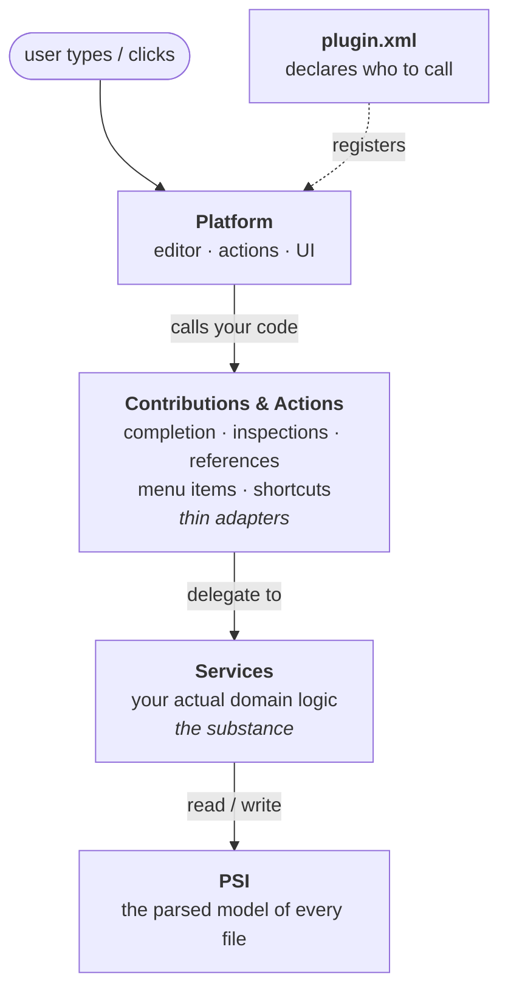
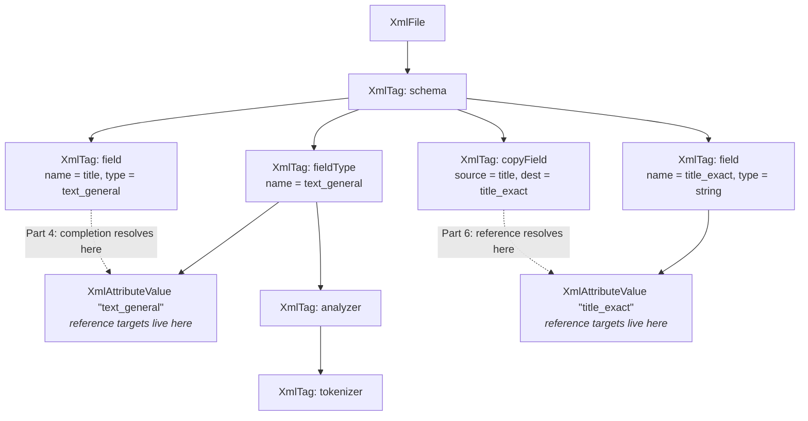
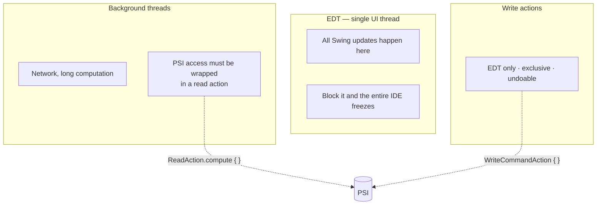

# Your First IntelliJ Plugin, the Modern Way

### A hands-on introduction for Java and Kotlin engineers

> **Status: draft.** Code samples are verified by inspection against IntelliJ Community source, not by build. This is a standalone teaching artifact — it uses `dev.example.solrconfig` package names and does *not* describe this repository's implementation in `src/`. It is being refined against that implementation as it lands.

You already know how to make a JVM project do something useful. This tutorial is about making your *IDE* do something useful — and it turns out the distance between those two skills is much shorter than most engineers assume.

By the end you'll have built a working plugin that adds code completion, a custom inspection with a quick-fix, and Ctrl-click navigation with rename refactoring to a file format the IDE has never heard of. Roughly 200 lines of Kotlin. No prior platform knowledge required.

The reason to do this now rather than three years ago: the tooling finally got good. The IntelliJ Platform Gradle Plugin 2.x replaced a decade of accumulated Groovy-era configuration with a clean, explicit Kotlin DSL. Project scaffolding is a form you fill in rather than a repo you clone and gut. The APIs you'll touch below have been stable for years, and the test framework runs a real headless IDE in a few seconds. Plugin development stopped being folklore.

---

## What we're building

Our subject is an Apache Solr **configset** — specifically `managed-schema`, an XML file that defines the fields of a search index. You need no Solr knowledge whatsoever. Here's the entire format we care about:

```xml
<schema name="example" version="1.6">
    <fieldType name="string"       class="solr.StrField"/>
    <fieldType name="text_general" class="solr.TextField">
        <analyzer>
            <tokenizer class="solr.StandardTokenizerFactory"/>
            <filter class="solr.LowerCaseFilterFactory"/>
        </analyzer>
    </fieldType>

    <field name="id"          type="string"       indexed="true" stored="true"/>
    <field name="title"       type="text_general" indexed="true" stored="true"/>
    <field name="title_exact" type="string"       indexed="true" stored="false"/>

    <copyField source="title" dest="title_exact"/>
</schema>
```

The `title` / `title_exact` pair is worth a word, since it recurs throughout the tutorial. It's the standard way to make one piece of content matchable two ways: `title` is tokenized, so a search for one word hits it; `title_exact` is an untokenized `string`, so it supports exact whole-value matching, sorting, and faceting. `copyField` duplicates the value into the second field at index time, so the application only ever sends `title`.

Three element types, and one relationship worth noticing: `<field type="...">` points at a `<fieldType name="...">`, and `<copyField source/dest>` points at `<field name="...">`. Those cross-references are strings. The IDE treats them as ordinary text, which means a typo produces no error anywhere — the file opens fine, and the failure surfaces much later at runtime. That's the exact shape of problem IDE tooling exists to kill, and it's why this makes a good tutorial subject: it's a real bug class, not a toy.

We'll ship three features:

1. **Completion** — typing inside `type="…"` suggests the field types defined in the file.
2. **An inspection with a quick-fix** — `copyField` pointing at a nonexistent field gets a warning, and Alt+Enter offers to create it.
3. **References** — Ctrl-click on `dest="title_exact"` jumps to the field, Find Usages works, and rename refactoring updates every reference. All from one small class.

Substitute your own domain and the same three patterns cover an enormous range of useful plugins.

---

## Prerequisites

- IntelliJ IDEA 2025.3 or newer. Since 2025.3 there is a single unified distribution — the old Community/Ultimate split is gone, and the free tier is all you need for this tutorial.
- **JDK 21** — see the note below
- Familiarity with Gradle Kotlin DSL

> **Why 21 and not the latest LTS?**
> A plugin runs *inside* the IDE process, on the JetBrains Runtime the IDE ships with — currently a JBR 21 build. Bytecode compiled for a newer release simply won't load there, so your target is dictated by the platform, not by what's newest.
>
> This is easy to confuse with a different fact: recent IntelliJ releases support developing against much newer Java versions. That's the Java your *projects* use. The two are independent — you can write Java 27 code in the IDE all day while the IDE itself runs on 21.
>
> Don't memorize the number. The SDK documents a required Java version per platform version, and it moves every few releases; check that table when you bump your target. You can also develop on a newer JDK and just pin the bytecode target — the Gradle toolchain handles it, and recent versions of the IntelliJ Platform Gradle Plugin default the toolchain to whatever your target platform requires, so you may not need to set it at all.

That's it. No SDK download, no special IDE edition. The Gradle plugin fetches the platform artifacts for you.

**Versions this tutorial targets**

| Component | Version |
|---|---|
| IntelliJ Platform (compile/test target) | 2026.2 |
| IntelliJ Platform Gradle Plugin | 2.16.0 |
| Kotlin | 2.1.0 |
| JDK / bytecode target | 21 |
| Minimum supported IDE (`sinceBuild`) | 253 (2025.3) |

Plugin development moves; when something below doesn't match what you see, the [SDK docs](https://plugins.jetbrains.com/docs/intellij/) are the source of truth.

---

## Part 1 — Scaffold and run (ten minutes)

Start from the **IntelliJ Platform Plugin Generator**: <https://plugins.jetbrains.com/generator>

If that name is new to you, that's because it is. Until recently there were *two* ways to start a plugin — a wizard inside the IDE, and a GitHub template repo — and they had annoyingly different feature sets. As of IntelliJ IDEA 2026.1 they've been merged into one web-API-backed generator, the same model Spring Initializr uses. JetBrains explained the reasoning in [IDE Plugin Generator – The New Beginning](https://blog.jetbrains.com/platform/2026/07/ide-plugin-generator-the-new-beginning/) (July 2026).

If you've used [start.spring.io](https://start.spring.io/), you already know how this works. Two ways in:

**In the browser** — open <https://plugins.jetbrains.com/generator>, choose *Plugin* (not *Theme*) at the top, tick the features you want, and hit **Download**. There's a *Preview* pane that lets you browse the generated files before committing, which is worth a minute of clicking just to see what each feature actually adds.

**In the IDE** — *File | New | Project…*, then **IDE Plugin** under *Generators*. Requires IntelliJ IDEA 2026.1+ with the [Plugin DevKit](https://plugins.jetbrains.com/plugin/22851-plugin-devkit) plugin installed. The first page now has a *Server URL* field — that's the generator API it's calling, the same one behind the web UI. Page two is the feature list.

Either client gives you the same project. For this tutorial you don't need to tick anything special; the defaults are fine. Two features are worth knowing about for later:

- **GitHub** (under *Version Control*) — CI workflows, issue templates, and Dependabot config. Tick this if you plan to publish; it's what the old template repo gave you.
- **Split Mode (Remote Dev)** (under *Architecture*) — scaffolding for remote development scenarios. Leave it off for now.

> **A note if you're following an older tutorial:** you'll see references to cloning `intellij-platform-plugin-template` from GitHub. That template and the old in-IDE wizard have both been folded into this generator. Templates now live in one place and are served fresh from the API, so you get current defaults without updating a plugin — but it does mean older instructions are describing something that no longer exists.

Either way you end up with a normal Gradle project whose build file looks roughly like this:

```kotlin
// build.gradle.kts
import org.jetbrains.intellij.platform.gradle.TestFrameworkType

plugins {
    kotlin("jvm") version "2.1.0"
    id("org.jetbrains.intellij.platform") version "2.16.0"
}

group = "dev.example"
version = "0.1.0"

kotlin { jvmToolchain(21) }   // optional on recent plugin versions — see the note above

repositories {
    mavenCentral()
    intellijPlatform { defaultRepositories() }
}

dependencies {
    intellijPlatform {
        intellijIdea("2026.2")   // the IDE you compile and test against
        testFramework(TestFrameworkType.Platform)
    }
    testImplementation("junit:junit:4.13.2")   // yes, JUnit 4 — see the note below
}

intellijPlatform {
    pluginConfiguration {
        id = "dev.example.solrconfig"
        name = "Solr Configset Support"
        ideaVersion {
            sinceBuild = "253"
            // untilBuild intentionally unset — forward compatible by default
        }
    }
    pluginVerification { ides { recommended() } }
}
```

Three lines deserve a second look:

- `intellijIdea("2026.2")` is a *compile and test* target, not a minimum — users on older builds are governed by `sinceBuild`. If you find older tutorials using `intellijIdeaCommunity(...)`, that predates the unified distribution.
- `testFramework(TestFrameworkType.Platform)` is easy to forget and produces baffling test-compilation errors when missing. It also needs that `import` at the top of the file — another easy miss.
- `id` is permanent. Once published, changing it means publishing a different plugin. Choose deliberately.

> **Why JUnit 4 in 2026?**
> Not an oversight — it's what the platform's test framework requires. `BasePlatformTestCase`, which you'll use in Part 7, descends from JUnit 3's `TestCase`, and the SDK's dependency documentation pairs `TestFrameworkType.Platform` with exactly this artifact.
>
> There is a `TestFrameworkType.JUnit5`, and it's the right choice for UI integration tests written against the Starter framework. But for the light PSI-level tests in this tutorial it currently carries two documented defects — a missing `opentest4j` dependency and JUnit 4 classes still referenced at runtime — so you'd add JUnit 4 back as a workaround anyway. Start on the supported path; revisit when those are closed.

Now the moment that makes it real:

```bash
./gradlew runIde
```

A second IntelliJ launches, with its own settings directory, your plugin installed. This is your dev loop for everything that follows. It's a JVM process like any other — `./gradlew runIde --debug-jvm` and attach a remote debugger if you like breakpoints, which you will.

> **Checkpoint.** Open *Settings → Plugins → Installed* in the sandbox and find your plugin by name. If it's there, your build is correct and everything after this is just writing code.

---

## Part 2 — The mental model

Before we write a single feature, I want to answer one question: **how does the IDE even know to call your code?**

Because you're about to write a class that does something useful, and nothing in that class will ever call itself. Something has to reach in and invoke it. Let's figure out what.

### You've already done this a hundred times

Here's a Spring controller:

```java
@RestController
class GreetingController {
    @GetMapping("/hello")
    String hello() { return "hi"; }
}
```

Think about what you *didn't* write there. No socket. No accept loop. No HTTP parsing. No thread pool. You wrote one method, told the framework where it belongs, and the framework calls it when a request shows up.

Plugin development is exactly that deal, with the IDE playing the role Tomcat plays. The IDE owns the loop — it knows when the user typed a character, when a file needs analyzing, when someone hit Ctrl+Space. You write small pieces of behavior and tell the platform where they belong. It calls you.

That's the whole model. If you're comfortable writing a controller without thinking about sockets, you're already comfortable with plugin development.

### So what's an extension point, really?

You'll see the term everywhere, and it sounds heavier than it is.

An **extension point is an interface plus a list of everybody who implemented it.**

That's genuinely it. `CompletionContributor` is an interface. The platform keeps a list of every class in every installed plugin that implements it. When the user hits Ctrl+Space, the platform walks that list and calls each one, asking "got anything for this position?"

Your job for each feature is two steps: implement the right interface, get on the right list.

Step one is ordinary Kotlin. Step two is where it gets unfamiliar.

### There is no component scanning. None.

In Spring, `@Component` is enough. The framework scans your classpath, finds the annotation, wires it up.

The IntelliJ Platform does not do this. There is no annotation that registers an extension. Your class gets on the list because you wrote it into an XML file:

```xml
<extensions defaultExtensionNs="com.intellij">
    <completion.contributor
        language="XML"
        implementationClass="dev.example.solrconfig.completion.FieldTypeCompletionContributor"/>
</extensions>
```

That file is `src/main/resources/META-INF/plugin.xml`, and it's the only wiring mechanism there is.

Now, why would they do it this way? Because a user might have sixty plugins installed, and the IDE has to start fast. Scanning sixty JARs for annotations at every startup would be brutal. Instead, each plugin ships a tiny XML file listing what it offers, the platform reads those in milliseconds, and it doesn't actually load or instantiate your class until the first time someone needs it. Lazy, cheap, predictable.

Good reason. But it means you need to internalize this:

**If your class isn't in `plugin.xml`, it does not exist.**

And here's the part that stings — nothing tells you. No warning at build time, no error at runtime, no log line. You write a beautiful completion contributor, hit Ctrl+Space in the sandbox, and get nothing. Not a stack trace. Just silence.

So when a feature doesn't fire, check `plugin.xml` before you check anything else. Every single one of us has lost an hour to this, exactly once, and then never again.

### So which lists are there?

Fair question, and I've been throwing words like *completion* and *inspection* around without saying what they are. Let's fix that, because these five terms cover almost everything you'll ever build.

They split into two groups, and the difference is simply **who pulls the trigger**.

**Group one: the platform calls you.** These fire on their own while the user works — nobody clicks anything. This is where most plugins live, and it's what people mean by *contributions*.

- **Completion** — the popup you get from Ctrl+Space. The platform notices the user wants suggestions at some position and asks everyone on the list, "got anything for here?"
- **Inspection** — the squiggly underline. The platform walks files looking for problems; you're the one who decides what counts as a problem. Attach a **quick-fix** and the user gets an Alt+Enter option to repair it.
- **Reference** — the thing that makes a string clickable. You answer "what does this text point at?" and the platform hands you Ctrl+click navigation, Find Usages, and rename refactoring off that one answer.
- **Line marker** — the little icon in the gutter beside a line, usually clickable to jump somewhere related.
- **Documentation** — the popup on Ctrl+Q, where you supply the text for your own concepts.

**Group two: the user calls you.** These are **actions** — a menu item, a toolbar button, a keyboard shortcut. Nothing happens until somebody explicitly triggers it. `Run Configuration`, `Reformat Code`, and everything in the Tools menu are actions. You'll write these when you need "do this thing now," like uploading a config or reloading a server.

Here's the whole vocabulary in one place:

| Term | What the user actually sees | Built in |
|---|---|---|
| Completion | Suggestion popup on Ctrl+Space | Part 4 |
| Inspection | Squiggly underline + warning | Part 5 |
| Quick-fix | The Alt+Enter repair offer | Part 5 |
| Reference | Ctrl+click, Find Usages, rename | Part 6 |
| Action | Menu item, button, shortcut | mentioned in Part 10 |
| Line marker | Gutter icon | not covered here |

We're building the first four. If a term shows up in a diagram before you've built it, this table is the place to look back to.


### Where does the actual logic go?

One more thing and then we build something.

When you register a completion contributor, the platform hands you a position in a file and asks what belongs there. It'd be tempting to do all your work right there in that class.

Don't. You already know why, because you know what a fat controller feels like six months later.

Same rule applies. Your contributor is a controller: unwrap the input, ask a service, wrap the result. That's what the diagram below means by a **thin adapter** — a class whose whole job is translating between the platform's world and yours. The service is where the thinking happens — parsing the schema, understanding field types, whatever your domain actually is.

The payoff is identical to Spring, too. When you later add an inspection that needs the same knowledge, it calls the same service. When you write tests, you test the service directly without booting anything. And when someone asks for a tool window showing the same data, it's already there.

Here's everything we just discussed in one picture:



Contributions thin, services fat. That's the one structural decision that determines whether your plugin is still pleasant to work on at ten features.

---

## Part 3 — PSI, the thing everything stands on

Alright. Our first feature needs to answer a simple question: *what field types are defined in this schema file?*

Let's think about how you'd normally do that.

You'd read the file. Parse the XML — pick your favorite library. Walk the tree, collect the `<fieldType>` elements, return the names. Twenty lines, tops. You've done this a hundred times.

Now let's talk about why that's wrong here. Not "suboptimal." Wrong.

**Problem one: the file on disk is stale.** The user is *typing*. The fieldType they added four seconds ago exists only in the editor buffer. Read from disk and you'll confidently return yesterday's answer.

**Problem two: you'd be re-parsing constantly.** Completion fires on keystrokes. Inspections run as the user types. Parse the whole file every time and you've built a space heater.

**Problem three: everyone else would be doing it too.** Every plugin, parsing the same file, over and over, each keeping its own copy.

So the platform solves this once, for everybody. And that solution is PSI.

### PSI is the parse tree the IDE already has

The IDE parsed that file the moment it opened. It re-parses incrementally as the user types — not the whole file, just what changed. It keeps that structure in memory, up to date, and shares it with every plugin.

**PSI (Program Structure Interface) is that structure.** You don't build it, you don't refresh it, you don't cache it. You ask for it and it's already correct.

There are three layers, and it's worth knowing which is which, because you'll see all three names:

| Layer | What it is | Java analogy |
|---|---|---|
| `VirtualFile` | The file itself — path, name, existence | `File` |
| `Document` | The text *right now*, including unsaved edits | `String` |
| `PsiFile` | The parsed structure of that text | the object graph after Jackson is done |

The difference from the analogy: your object graph goes stale the instant the JSON changes. PSI doesn't. It's maintained live, which is the entire point.

You'll work at the PSI layer almost exclusively.

### What our file looks like as PSI

Here's the schema from earlier, as the tree the platform hands you:



Solid arrows are the tree. The dotted arrows are the interesting part — those are the cross-references we talked about at the start, the ones that are just strings today. Making them real is what Parts 4 and 6 are about.

Navigating this is less API than you'd expect:

```kotlin
val schema: XmlTag? = xmlFile.rootTag                    // <schema>
val types: Array<XmlTag> = schema.findSubTags("fieldType")
val name: String? = types.first().getAttributeValue("name")
```

`rootTag`, `findSubTags`, `getAttributeValue`. That's most of what this tutorial uses. It's a tree, and you walk it.

### The reframe that makes the rest of this easy

Here's what I wish someone had told me on day one.

Every feature you're about to build is a **question about this tree**:

- **Completion** — *given the node at the caret, what could go here?*
- **Inspection** — *walk the tree; which nodes are wrong?*
- **Reference** — *this string; which node does it point at?*

Three questions, one tree. The APIs in Parts 4, 5, and 6 look different on the surface, but underneath you're doing the same thing every time: get a node, look around, answer a question.

That's why plugin development stops feeling large once you start. You're not learning a framework. You're learning where to plug in — and then it's tree traversal and your own domain knowledge, which you already have.

### One guard before we start

Last thing. When you register a contributor for XML, you get called for **every XML file the user opens**. Their `pom.xml`. Some Spring config. A file you've never heard of.

So every feature starts by confirming we're actually looking at a schema:

```kotlin
package dev.example.solrconfig

import com.intellij.psi.xml.XmlFile

object SchemaDetector {
    fun isSchema(file: XmlFile): Boolean {
        val name = file.name
        if (name != "managed-schema" && name != "managed-schema.xml" && name != "schema.xml") return false
        return file.rootTag?.localName == "schema"
    }
}
```

Filename check first, structure check second — this runs on every keystroke, so the cheap test goes first and short-circuits.

Skip this guard and you'll ship a plugin that suggests Solr field types inside somebody's `pom.xml`. Users notice.

Now let's build something.

---

## Part 4 — Feature 1: Completion

### The service

Domain logic goes in a service — a lazily instantiated singleton scoped to a project. `@Service` needs no manifest entry.

```kotlin
package dev.example.solrconfig

import com.intellij.openapi.components.Service
import com.intellij.psi.xml.XmlFile
import com.intellij.psi.xml.XmlTag

data class SchemaField(val name: String, val type: String, val tag: XmlTag)
data class SchemaFieldType(val name: String, val className: String, val tag: XmlTag)

@Service(Service.Level.PROJECT)
class SchemaModelService {

    fun fields(file: XmlFile): List<SchemaField> =
        file.rootTag?.findSubTags("field")?.mapNotNull { tag ->
            val name = tag.getAttributeValue("name") ?: return@mapNotNull null
            SchemaField(name, tag.getAttributeValue("type").orEmpty(), tag)
        }.orEmpty()

    fun fieldTypes(file: XmlFile): List<SchemaFieldType> =
        file.rootTag?.findSubTags("fieldType")?.mapNotNull { tag ->
            val name = tag.getAttributeValue("name") ?: return@mapNotNull null
            SchemaFieldType(name, tag.getAttributeValue("class").orEmpty(), tag)
        }.orEmpty()

    fun findField(file: XmlFile, name: String): SchemaField? =
        fields(file).firstOrNull { it.name == name }
}
```

Plain Kotlin over an XML tree. Nothing platform-specific except the types.

### The contributor

```kotlin
package dev.example.solrconfig.completion

import com.intellij.codeInsight.completion.*
import com.intellij.codeInsight.lookup.LookupElementBuilder
import com.intellij.openapi.components.service
import com.intellij.patterns.PlatformPatterns
import com.intellij.patterns.XmlPatterns
import com.intellij.psi.xml.XmlFile
import com.intellij.util.ProcessingContext
import dev.example.solrconfig.SchemaDetector
import dev.example.solrconfig.SchemaModelService

class FieldTypeCompletionContributor : CompletionContributor() {
    init {
        extend(
            CompletionType.BASIC,
            // "the token at the caret, inside an attribute value,
            //  of an attribute named `type`, inside a `field` tag"
            PlatformPatterns.psiElement().withParent(
                XmlPatterns.xmlAttributeValue()
                    .withParent(
                        XmlPatterns.xmlAttribute().withLocalName("type")
                            .withParent(XmlPatterns.xmlTag().withLocalName("field"))
                    )
            ),
            object : CompletionProvider<CompletionParameters>() {
                override fun addCompletions(
                    parameters: CompletionParameters,
                    context: ProcessingContext,
                    result: CompletionResultSet,
                ) {
                    val file = parameters.originalFile as? XmlFile ?: return
                    if (!SchemaDetector.isSchema(file)) return

                    file.project.service<SchemaModelService>().fieldTypes(file).forEach { ft ->
                        result.addElement(
                            LookupElementBuilder.create(ft.name)
                                .withTypeText(ft.className)   // grey right-aligned hint
                        )
                    }
                }
            }
        )
    }
}
```

The interesting part is the middle argument. `XmlPatterns` is a declarative matcher DSL: instead of `if (element.parent is XmlAttribute && ...)`, you describe the *shape* of the location, and the platform decides whether you're relevant. Every position-sensitive extension point uses this DSL, so learning it once pays off repeatedly.

The outer `PlatformPatterns.psiElement()` is not decoration, and getting it wrong is a silent failure. `extend()` matches your pattern against `parameters.position` — the **leaf** element at the caret. Inside `type="<caret>"` that leaf is an `XmlToken`, *not* the `XmlAttributeValue` containing it. Write `XmlPatterns.xmlAttributeValue()` as the outermost pattern and it simply never matches: no completion, no error, nothing in the log.

So the shape to internalize for completion is **describe the leaf, then walk up**: `psiElement().withParent(...)` — or `.inside(...)` when you don't care how many levels up the interesting node sits.

Worth flagging now because Part 6 looks almost identical but isn't: reference contributors match against the *host* element, so there `XmlPatterns.xmlAttributeValue()` on the outside is correct. Same DSL, different subject. Copying one shape into the other is a very easy afternoon to lose.

### Register it

```xml
<!-- src/main/resources/META-INF/plugin.xml -->
<idea-plugin>
    <id>dev.example.solrconfig</id>
    <name>Solr Configset Support</name>
    <vendor>Example</vendor>

    <depends>com.intellij.modules.platform</depends>
    <depends>com.intellij.modules.xml</depends>

    <extensions defaultExtensionNs="com.intellij">
        <completion.contributor
            language="XML"
            implementationClass="dev.example.solrconfig.completion.FieldTypeCompletionContributor"/>
    </extensions>
</idea-plugin>
```

### The step that will bite you: extensionless files

Try that checkpoint on a file literally named `managed-schema`, with no extension, and nothing happens. No completion, no error, no clue.

Here's why. We registered our contributor for `language="XML"`, so the platform only offers us files it has *parsed as XML*. File type detection is driven mainly by extension, and `managed-schema` doesn't have one — so as far as the IDE is concerned it's a plain text file. There's no XML PSI, so there's nothing for us to be asked about.

This isn't a Solr quirk. Any format with extensionless or unusual filenames hits it: `Dockerfile`, `.gitconfig`, `Jenkinsfile`.

The fix is to associate the filename with the existing XML file type:

```xml
<extensions defaultExtensionNs="com.intellij">
    <fileType name="XML" fileNames="managed-schema"/>
</extensions>
```

Note what this is *not* doing: no `implementationClass`, no new language. Naming an existing file type and supplying extra matchers just adds those matchers to it. The bundled Maven plugin does exactly this to make `.pom` files XML:

```xml
<fileType name="XML" extensions="pom"/>
```

Available matchers are `extensions`, `fileNames` (exact names), and `patterns` (wildcards). Now the file parses as XML, our contributor gets called, and the checkpoint works.

Worth internalizing as a general rule: **before asking why your contributor isn't firing, confirm the IDE thinks the file is the language you registered for.** It's the second-most-common cause after a missing `plugin.xml` entry.

> **Checkpoint.** `./gradlew runIde`, open a `managed-schema`, type `<field name="x" type="` and hit Ctrl+Space. Your field types appear, with their class names alongside. That's a real IDE feature, in about forty lines.

Note also what declaring only `modules.platform` and `modules.xml` buys you: this plugin installs in PyCharm, WebStorm, and every other JetBrains IDE. Java-specific features go behind an optional dependency so they load only where Java support exists:

```xml
<depends optional="true" config-file="java-features.xml">com.intellij.modules.java</depends>
```

---

## Part 5 — Feature 2: An inspection with a quick-fix

Inspections are how you turn domain knowledge into warnings. The contract is small: return a visitor, register problems on elements.

```kotlin
package dev.example.solrconfig.inspection

import com.intellij.codeInspection.*
import com.intellij.openapi.components.service
import com.intellij.openapi.project.Project
import com.intellij.psi.PsiElementVisitor
import com.intellij.psi.XmlElementVisitor
import com.intellij.psi.xml.XmlFile
import com.intellij.psi.xml.XmlTag
import dev.example.solrconfig.SchemaDetector
import dev.example.solrconfig.SchemaModelService

class DanglingCopyFieldInspection : LocalInspectionTool() {

    override fun buildVisitor(holder: ProblemsHolder, isOnTheFly: Boolean): PsiElementVisitor =
        object : XmlElementVisitor() {
            override fun visitXmlTag(tag: XmlTag) {
                if (tag.localName != "copyField") return
                val file = tag.containingFile as? XmlFile ?: return
                if (!SchemaDetector.isSchema(file)) return

                val model = holder.project.service<SchemaModelService>()

                for (attrName in listOf("source", "dest")) {
                    val value = tag.getAttributeValue(attrName) ?: continue
                    if (value.contains('*')) continue                  // dynamic field pattern
                    if (model.findField(file, value) != null) continue

                    val target = tag.getAttribute(attrName)?.valueElement ?: tag
                    holder.registerProblem(
                        target,
                        "Field '$value' is not defined in this schema",
                        ProblemHighlightType.GENERIC_ERROR_OR_WARNING,
                        CreateFieldQuickFix(value),
                    )
                }
            }
        }
}
```

And the fix that appears under Alt+Enter:

```kotlin
class CreateFieldQuickFix(private val fieldName: String) : LocalQuickFix {

    override fun getFamilyName(): String = "Create missing schema field"
    override fun getName(): String = "Create string field '$fieldName'"

    override fun applyFix(project: Project, descriptor: ProblemDescriptor) {
        val file = descriptor.psiElement.containingFile as? XmlFile ?: return
        val schema = file.rootTag ?: return

        val newField = schema.createChildTag("field", schema.namespace, null, false).apply {
            setAttribute("name", fieldName)
            setAttribute("type", "string")
            setAttribute("indexed", "true")
            setAttribute("stored", "true")
        }
        schema.addSubTag(newField, false)
    }
}
```

Registration, plus one mandatory extra file:

```xml
<localInspection
    language="XML"
    shortName="DanglingCopyField"
    displayName="copyField references an undefined field"
    groupName="Solr"
    enabledByDefault="true"
    level="WARNING"
    implementationClass="dev.example.solrconfig.inspection.DanglingCopyFieldInspection"/>
```

```html
<!-- src/main/resources/inspectionDescriptions/DanglingCopyField.html -->
<html><body>
Reports <code>copyField</code> elements whose <code>source</code> or <code>dest</code>
does not match any field in the schema. Such directives fail when the core reloads,
or silently copy nothing.
</body></html>
```

The filename must match `shortName`. That's how the platform finds the docs shown in *Settings → Editor → Inspections* — and it's a quietly excellent convention, because it makes "every inspection is documented" a build-time fact rather than a code-review aspiration.

Notice what you didn't write: no file watcher, no incremental re-analysis, no caching, no debounce. You wrote a visitor. The platform runs it as the user types, keeps results fresh, reports them in the gutter and the scrollbar, batches them under *Analyze → Inspect Code*, and lets users suppress or reconfigure severity. That asymmetry between what you write and what users get is the whole reason plugin development is worth learning.

> **Checkpoint.** In the sandbox, add `<copyField source="title" dest="nope"/>`. Yellow squiggle. Alt+Enter → *Create string field 'nope'*. The field appears in the schema.

---

## Part 6 — Feature 3: References (three features for the price of one)

Now the payoff. Implement one interface — "what does this string point to?" — and the platform derives navigation, Find Usages, *and* rename refactoring from it.

```kotlin
package dev.example.solrconfig.reference

import com.intellij.openapi.components.service
import com.intellij.openapi.util.TextRange
import com.intellij.psi.*
import com.intellij.patterns.XmlPatterns
import com.intellij.psi.xml.XmlAttributeValue
import com.intellij.psi.xml.XmlFile
import com.intellij.util.ProcessingContext
import com.intellij.codeInsight.lookup.LookupElementBuilder
import dev.example.solrconfig.SchemaDetector
import dev.example.solrconfig.SchemaModelService

class CopyFieldReference(element: XmlAttributeValue) :
    PsiReferenceBase<XmlAttributeValue>(element, TextRange(1, element.textLength - 1)) {
    //                                            ^ strip the surrounding quotes

    override fun resolve(): PsiElement? {
        val file = element.containingFile as? XmlFile ?: return null
        return element.project.service<SchemaModelService>()
            .findField(file, value)
            ?.tag
            ?.getAttribute("name")          // resolve to the *name attribute value*,
            ?.valueElement                  // not the <field> tag — see below
    }

    override fun getVariants(): Array<Any> {
        val file = element.containingFile as? XmlFile ?: return emptyArray()
        return element.project.service<SchemaModelService>()
            .fields(file)
            .map { LookupElementBuilder.create(it.name) }
            .toTypedArray()
    }
}

class SchemaReferenceContributor : PsiReferenceContributor() {
    override fun registerReferenceProviders(registrar: PsiReferenceRegistrar) {
        registrar.registerReferenceProvider(
            XmlPatterns.xmlAttributeValue().withParent(
                XmlPatterns.xmlAttribute().withLocalName("source", "dest")
                    .withParent(XmlPatterns.xmlTag().withLocalName("copyField"))
            ),
            object : PsiReferenceProvider() {
                override fun getReferencesByElement(
                    element: PsiElement,
                    context: ProcessingContext,
                ): Array<PsiReference> {
                    val value = element as? XmlAttributeValue ?: return PsiReference.EMPTY_ARRAY
                    val file = element.containingFile as? XmlFile ?: return PsiReference.EMPTY_ARRAY
                    if (!SchemaDetector.isSchema(file)) return PsiReference.EMPTY_ARRAY
                    return arrayOf(CopyFieldReference(value))
                }
            }
        )
    }
}
```

`withLocalName` takes varargs, which is why one pattern covers both `source` and `dest`.

### Resolve to the name, not to the tag

Those two lines at the end of `resolve()` are the difference between rename working and rename corrupting the file, so they're worth dwelling on.

The obvious thing is to resolve to the `<field>` tag — it's the declaration, after all. Ctrl-click would even work. But `XmlTag` implements `PsiNamedElement`, and for a tag, "name" means the **tag name**: `field`. So Shift+F6 on that target offers to rename `<field>` itself, and accepting turns `<field name="title_exact"/>` into `<whatever name="title_exact"/>`. Find Usages has the same problem — it searches for the tag's name, not `title_exact`.

Resolving to the `name` attribute's *value element* fixes both, because for an `XmlAttributeValue` the name genuinely is the string the user cares about. This is what the PSI diagram back in Part 3 meant by *"reference targets live here."*

General rule, and it outlives this example: **resolve to the element whose `getName()` returns the identifier you want renamed.** When rename misbehaves, that question is almost always the answer.

```xml
<psi.referenceContributor
    language="XML"
    implementation="dev.example.solrconfig.reference.SchemaReferenceContributor"/>
```

> **Checkpoint.** Ctrl-click `dest="title_exact"` → jumps to that field's definition. Alt+F7 on a field name → Find Usages lists the copyField. Shift+F6 on a field → rename updates every reference. And `getVariants()` gave you completion inside those attributes for free.

Roughly thirty lines, four user-visible features. This is the moment most people stop thinking of plugin development as expensive.

---

## Part 7 — Testing

Plugin tests run a real headless platform, so you assert against genuine PSI rather than mocks — and they start in seconds.

```kotlin
package dev.example.solrconfig

import com.intellij.testFramework.fixtures.BasePlatformTestCase
import dev.example.solrconfig.inspection.DanglingCopyFieldInspection

class DanglingCopyFieldInspectionTest : BasePlatformTestCase() {

    override fun getTestDataPath() = "src/test/testData"

    fun `test dangling dest is reported`() {
        myFixture.enableInspections(DanglingCopyFieldInspection::class.java)
        myFixture.configureByFile("dangling/managed-schema.xml")
        myFixture.checkHighlighting()
    }

    fun `test quick fix creates the field`() {
        myFixture.enableInspections(DanglingCopyFieldInspection::class.java)
        myFixture.configureByFile("dangling/managed-schema.xml")
        val fix = myFixture.getAllQuickFixes().first { it.text.startsWith("Create string field") }
        myFixture.launchAction(fix)
        myFixture.checkResultByFile("dangling/managed-schema.after.xml")
    }

    fun `test completion offers field types`() {
        myFixture.configureByFile("completion/managed-schema.xml")
        myFixture.completeBasic()
        assertContainsElements(myFixture.lookupElementStrings!!, "string", "text_general")
    }
}
```

Note the `.xml` extensions on the test data files. The fixture picks a language by extension just like the editor does, so an extensionless `managed-schema` in test data would be parsed as plain text and every assertion would fail confusingly. Same trap as the previous section, different place.

Expected warnings are expressed inline in the test data itself, which keeps assertions readable:

```xml
<copyField source="title"
           dest="<warning descr="Field 'nope' is not defined in this schema">nope</warning>"/>
```

And completion tests mark the caret with `<caret>`:

```xml
<field name="x" type="<caret>"/>
```

`checkHighlighting()` fails if reported problems don't match the markup *exactly* — including problems you didn't expect, which makes false positives impossible to ignore. A useful habit: keep a real-world sample of your format in test data and assert it produces zero warnings. That single test catches most over-eager inspections before users do.

---

## Part 8 — When you leave static analysis: threading

Everything so far ran inside machinery the platform had already set up for you. The moment you make a network call or write from an action, three rules start to matter — and this is the one area with no Spring analog, so it's worth reading before you need it.



In practice:

```kotlin
// Reading PSI off the EDT
val fields = ReadAction.compute<List<SchemaField>, Throwable> {
    project.service<SchemaModelService>().fields(file)
}

// Mutating PSI — write action, EDT, appears in undo history
WriteCommandAction.runWriteCommandAction(project) {
    tag.setAttribute("indexed", "true")
}

// Long-running work with progress and cancellation
ProgressManager.getInstance().run(object : Task.Backgroundable(project, "Contacting server") {
    override fun run(indicator: ProgressIndicator) {
        // HTTP here — never on the EDT
    }
})
```

Modern platform code increasingly uses coroutines (services can expose a scope; `Dispatchers.EDT` exists), but the underlying read/write discipline is unchanged. Inspections, completion contributors, and reference providers already run inside a read action — you inherit correct behavior for free, which is why Parts 4–6 never mentioned threading.

---

## Part 9 — Shipping

Two commands separate a working sandbox plugin from a published one.

```bash
./gradlew verifyPlugin   # binary compatibility across IDE versions
./gradlew buildPlugin    # → build/distributions/your-plugin-0.1.0.zip
```

`verifyPlugin` deserves a moment of respect. It checks your compiled bytecode against the IDEs you list under `pluginVerification { ides { ... } }` and fails on APIs that don't exist there. Because plugins are distributed as bytecode into IDEs you never tested against, this is the difference between "works on my machine" and "works for the person on last year's release." Put it in CI on day one; it costs nothing and prevents your most embarrassing bug reports.

One precision worth having, though: `recommended()` resolves to a curated set of builds, not to every build from `sinceBuild` onward. That's a strong sample, not proof of range-wide compatibility. If you claim a long tail, widen the list deliberately.

Beyond that: install the ZIP locally via *Settings → Plugins → ⚙ → Install Plugin from Disk* to sanity-check it, then `publishPlugin` with a Marketplace token when you're ready. First-time submissions go through a review; subsequent updates publish immediately.

---

## Part 10 — The seven things that will trip you up

1. **Nothing is auto-registered.** No `plugin.xml` entry, no feature, no warning. Check the manifest first, always.
2. **The IDE has to agree about the file's language.** If it isn't parsed as what you registered for, you're never called. Extensionless filenames are the usual culprit.
3. **Your code sees every file of that language.** Guard on identity or you'll pollute completion in unrelated files.
4. **PSI elements are invalidated by edits.** Don't cache them across operations; use `SmartPsiElementPointer` if you must hold one.
5. **The EDT is sacred.** Any I/O goes on a background task with a progress indicator.
6. **`@ApiStatus.Internal` and `@Experimental` will break.** They're not covered by compatibility promises. `verifyPlugin` tells you before users do.
7. **The plugin ID is permanent.** Decide before your first publish.

And one bonus, because it wastes an afternoon the first time: **the sandbox has its own configuration.** Settings you change there don't affect your real IDE — occasionally confusing when a feature "only works on my machine."

---

## Where to go next

You've now used the four patterns that most plugins are made of — services, position-based contributions, tree visitors, and references. The natural next steps, in rough order of effort:

- **Actions** (`AnAction`) for user-triggered commands, with menu placement and shortcuts.
- **Tool windows** (`ToolWindowFactory`) for dockable panels. UI is Swing with JetBrains' components, and the Kotlin UI DSL makes forms tolerable.
- **Settings** (`Configurable` + `PersistentStateComponent`), with secrets in `PasswordSafe` rather than your own state.
- **Line markers and inlay hints** for gutter icons and inline annotations.
- **A custom language** if your format isn't XML/JSON — a bigger commitment: lexer, parser, PSI element hierarchy.
- **MCP tools**, if you want AI agents to reach your plugin's knowledge. IntelliJ IDEs have shipped a built-in MCP server since 2025.2, and plugins can contribute tools to it — a genuinely new frontier, and a small adapter over services you've already written.

### What this tutorial deliberately doesn't cover

Worth being explicit, so you know when to stop reading me and go elsewhere.

We layered intelligence onto a format the IDE *already parses* — XML. If your format is genuinely new, you need a lexer, a parser, and your own PSI element hierarchy, and none of that is here. The official [Custom Language Support Tutorial](https://plugins.jetbrains.com/docs/intellij/custom-language-support-tutorial.html) covers that path end to end, with a complete working sample. It's excellent and considerably more thorough than this on that specific subject.

Also absent: tool windows and Swing UI, settings and persistence, run configurations, indexing and stubs, localization, and the paid-plugin/licensing story. Each has SDK documentation.

The gap this tutorial fills is narrower than "learn plugin development": it's the on-ramp for someone who wants to add intelligence to a format that already has a parser, and who thinks in Spring idioms. If that's not you, the official docs are the better starting point.

### Further reading

- [IntelliJ Platform SDK](https://plugins.jetbrains.com/docs/intellij/) — canonical reference; the [Quick Start Guide](https://plugins.jetbrains.com/docs/intellij/plugins-quick-start.html) is the entry point
- [Custom Language Support Tutorial](https://plugins.jetbrains.com/docs/intellij/custom-language-support-tutorial.html) — the full lexer-and-parser path
- [intellij-sdk-code-samples](https://github.com/JetBrains/intellij-sdk-code-samples) — runnable examples, CI-tested; the highest-value companion to any tutorial
- [IntelliJ Community source](https://github.com/JetBrains/intellij-community) — every bundled feature is a working example. Searching for an extension point name surfaces a dozen real implementations, which beats documentation for learning idiom
- [IntelliJ Platform Explorer](https://plugins.jetbrains.com/intellij-platform-explorer) — indexes extension points across open-source plugins; the fastest way to answer "is there a hook for this, and who else uses it?"
- [plugin-dev.com](https://www.plugin-dev.com/intellij/) — independent articles on topics the official docs skim

### A note on verification

The APIs used here were checked against IntelliJ Community source rather than assumed — in particular `XmlNamedElementPattern.withLocalName(String...)`, the `com.intellij.fileType` pattern of extending an existing file type by name (which the bundled Maven plugin uses for `.pom`), that `CompletionContributor.extend` matches against the leaf `parameters.position`, and that `XmlTag.getName()` returns the tag name rather than a `name` attribute.

The code has **not** been compiled end to end as a single project. Treat the samples as correct-by-inspection, not verified-by-build, and open an issue if something doesn't compile against your platform version.

Known gaps, stated plainly rather than left for you to discover: Part 9 does not cover plugin signing, which JetBrains Marketplace requires before `publishPlugin` will accept an upload, nor the `pluginIcon.svg` and `<description>` that Marketplace review expects. The samples also hardcode English strings where the platform convention is a message bundle, and the inspection re-walks the schema for each `copyField` where a production plugin would cache derived data via `CachedValuesManager`. Each of those is a deliberate simplification for a first plugin; none of them is advice.

The through-line worth taking away: **the platform APIs are small and repetitive; your domain knowledge is the actual work.** You spent this tutorial learning maybe six types. Everything else was ordinary Kotlin over a tree. Whatever format, framework, or tool your team knows deeply, the gap between that knowledge and an IDE feature that encodes it is smaller than you thought this morning.

---

## Appendix — Screenshot shot list

Screenshots to capture before publishing. Each entry gives the exact state to set up, what to frame, and draft alt text. Numbering matches the order they appear.

**Capture settings for consistency:** light theme (renders better on most blogs), default font size at 100% zoom, editor width around 900px, window scaled so text is legible at 800px wide. Redact any real project paths in the title bar. Retina/2x capture, then downscale — text stays crisp.

| # | Where | What to capture | Draft alt text |
|---|---|---|---|
| 1 | Part 1, after the generator links | The web generator at `plugins.jetbrains.com/generator` with *Plugin* selected and the Preview pane open on a generated file | "The IntelliJ Platform Plugin Generator web UI, with the file preview pane open" |
| 2 | Part 1, after the IDE-client paragraph | *File \| New \| Project…* → **IDE Plugin** under Generators, first page, Server URL field visible | "The New Project dialog with the IDE Plugin generator selected" |
| 3 | Part 1, same place | Generator page two — the Features list, with the GitHub and Split Mode groups visible | "Feature selection in the IDE Plugin wizard" |
| 4 | Part 1, after `./gradlew runIde` | The sandbox IDE, *Settings → Plugins → Installed*, your plugin highlighted in the list | "The plugin appearing in the sandbox IDE's installed plugins list" |
| 5 | Part 4 checkpoint | Completion popup open inside `type="` showing `string` and `text_general`, with class names in grey on the right | "Code completion suggesting Solr field types, with class names shown as type text" |
| 6 | Part 5 checkpoint | The warning squiggle under `dest="nope"` with the tooltip visible | "An inspection warning on a copyField pointing at an undefined field" |
| 7 | Part 5 checkpoint | Alt+Enter menu open, *Create string field 'nope'* highlighted | "The quick-fix menu offering to create the missing field" |
| 8 | Part 5, after the fix | Side-by-side or before/after of the schema with the new `<field>` element added | "The schema after the quick-fix has created the missing field" |
| 9 | Part 6 checkpoint | Ctrl/Cmd hover on `dest="title_exact"` showing the underline and target tooltip | "Ctrl+click navigation from a copyField reference to its field definition" |
| 10 | Part 6 checkpoint | Find Usages results panel listing the copyField occurrence | "Find Usages listing references to a schema field" |
| 11 | Part 6 checkpoint | The Rename dialog (Shift+F6) on a field name | "Rename refactoring on a schema field, working through the reference we implemented" |
| 12 | Part 7 | Test run panel with the three tests green | "The plugin's tests passing in the headless platform harness" |
| 13 | Part 9 | Plugin Verifier output in the Gradle console, or its HTML report | "Plugin Verifier reporting compatibility across IDE versions" |

Optional but high-impact: a short GIF for #5–#7 (type, get completion, trigger the inspection, apply the fix). That sequence is the article's payoff and it moves.

**On reusing JetBrains' images:** the generator blog post contains three official screenshots of the exact dialogs in #1–#3. They're JetBrains' copyrighted images — link to the post rather than re-hosting them, and capture your own for anything you publish.
