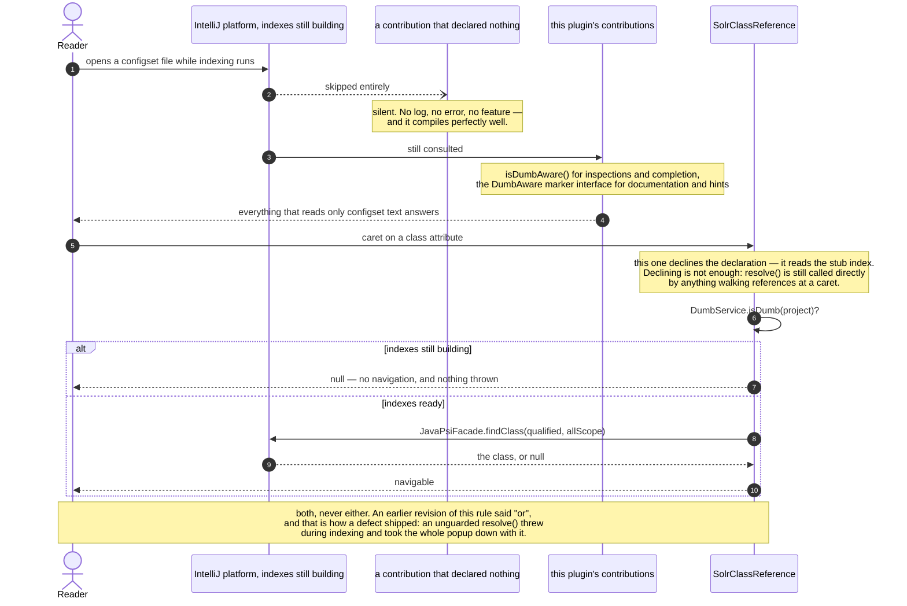
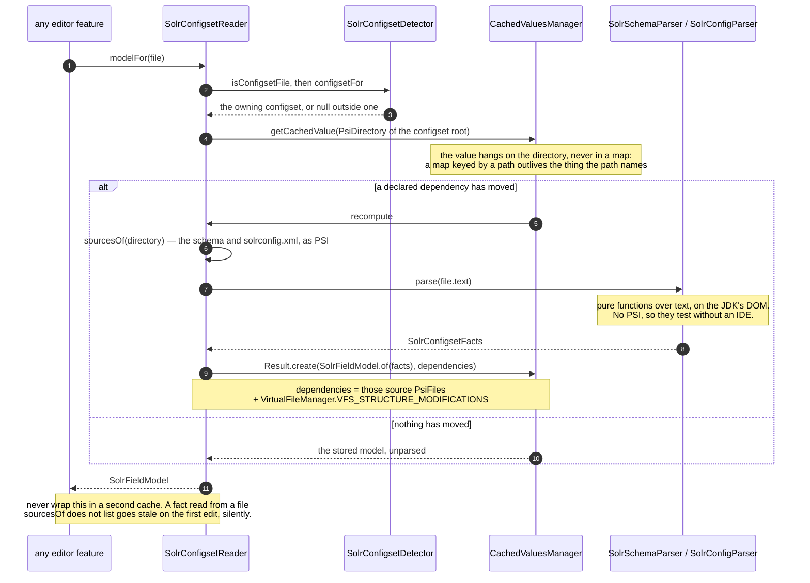

# Platform mechanisms this plugin relies on

> **Who this is for.** A Java engineer who wants to know why dumb mode and the field-model cache
> are handled the way they are before touching either — both have already produced a real defect.
> **Read first:** [Glossary](glossary.md) if IntelliJ Platform terms are new ·
> [code-organization.md](code-organization.md)

Two IntelliJ Platform mechanisms shape code all over this plugin, and neither is
guessable from reading that code. Both were originally worked around rather than
used — one silently, for months — so this records what they are, what we decided,
and why.

This is not a substitute for the [SDK documentation]. It is the part that is
specific to us: the decision, the reasoning, and the evidence.

[SDK documentation]: https://plugins.jetbrains.com/docs/intellij/

---

## Dumb mode, and `DumbAware`

### What it is

When you open a project, IntelliJ builds **indexes** — a searchable database of
every class, symbol and word in it. That takes seconds on a small project and
minutes on a large one. Until it finishes, the IDE is in **[dumb mode](glossary.md#dumb-mode)**: it
runs, you can read and type, but anything backed by an index cannot answer, because its
data source is half-built.

> **In Java terms.** Dumb mode is the index being a database still importing — every query against
> it fails, or is skipped outright, until the import finishes. `DumbAware` is not "this code is
> thread-safe" or any other cross-cutting marker interface you may know from Java; it is a narrow
> promise about one thing only — *I read no index* — and the two ways to make that promise differ by
> extension point (an overridden method here, a marker interface there) with no compiler check that
> you picked the right one for the base class you extended.

The platform's rule is deliberately conservative:

> A contribution that has not declared itself dumb-aware is **skipped entirely**
> while the project is indexing.

The reasoning is sound. Answering from a partial index produces confidently wrong
results — a [Find Usages](glossary.md#find-usages) that reports three usages when there are nine is worse
than one that declines to answer. So the default is silence, and a feature that
does not need an index has to say so. `DumbAware` is that declaration: *I read no
index; run me anyway.*

### Why it mattered here

**Nothing in this plugin reads an index.** The field model is parsed from the text
of `managed-schema.xml` and `solrconfig.xml`. The activation gate reads library
names off the project model rather than [PSI](glossary.md#psi). There is no stub index, no file-based
index, no symbol lookup anywhere in it — with one exception, added later: resolving
the class a `class` attribute names goes through `JavaPsiFacade`, which is why that
one contribution both declines in dumb mode and guards with `DumbService`.

We had simply never said so. The consequence was that completion, all three
inspections, quick documentation and the inline match hints did nothing at all
while a project indexed — and then started working, with nothing logged and no
visible cause.

That is the worst possible failure shape for an editor plugin. It is not a crash
and it is not a wrong answer; it is *absence*, during the exact window when
someone opening a Solr project for the first time is most likely to be opening
configset files. The reasonable conclusion for that user is that the plugin is
broken or flaky, and the reasonable next action is to uninstall it.

### The decision

**Every contribution that can declare dumb-awareness does.** There is no case
where waiting for the index buys correctness, because no answer this plugin gives
depends on one.

Opting in is not uniform, which is the trap. Some platform base classes expose a
method to override; others take a marker interface; one has neither. These were
verified by compilation against the platform on the build classpath, not assumed:

| Contribution | How it opts in |
|---|---|
| `LocalInspectionTool` ([inspection](glossary.md#inspection)) | `override fun isDumbAware()` |
| [`CompletionContributor`](glossary.md#completion-contributor) | `override fun isDumbAware()` |
| [`DocumentationProvider`](glossary.md#documentation-provider) | `DumbAware` marker interface |
| Declarative [inlay](glossary.md#inlay-hint) provider | `DumbAware` marker interface |
| `PsiReferenceContributor` | **neither** — [reference](glossary.md#reference) contributors are not filtered this way |

The marker-interface cases are the dangerous ones. Adding `DumbAware` to a class
the platform does not check for it **compiles cleanly and does nothing**, so a
wrong guess here produces code that looks correct forever. Overriding a method
that does not exist at least fails the build, which is how the
`PsiReferenceContributor` row above was established.

What that buys, and what it does not, in one sequence — the last exchange is the
rule this project learned by shipping the other version of it:

### The evidence

`SolrSchemaVocabularyCompletionTest.testCompletionAnswersWhileTheProjectIsIndexing`
asserts completion inside `DumbModeTestUtils.runInDumbModeSynchronously`.

It was checked to **fail** with the override removed, not merely to pass with it
present. That check is the point of the test: a dumb-mode test that would pass
either way asserts nothing, and this repository has already produced one
vacuous test that had to be rewritten after being taken at face value.

### What this does not license

Dumb-awareness is a claim about *this* plugin's current implementation, not a
default to carry forward. Any future feature that reads an index — a Find Usages
provider backed by a stub index, a SolrJ recognizer resolving Java symbols — must
either drop the declaration or guard the index access with `DumbService`.

The rule worth carrying: **`isDumbAware` is a promise about data sources.** Adding
an index to a feature that declares it is a silent correctness bug, and nothing in
the build will catch it.

---

## Caching the field model

### The problem

Every editor feature asks the same question — *what fields does this configset
declare?* Completion, all three inspections, the inline hints, hover documentation
and reference resolution, each of them many times per keystroke. Answering means
parsing two XML files.

Parsing per question is not affordable, so the model is cached. The whole
difficulty is in the other half: **knowing when to throw it away.**

Both directions are expensive to get wrong, and they are not symmetrical.

- Rebuild too rarely and the plugin reports a field the user just deleted. Every
  feature is then confidently wrong at once, which is the failure this plugin
  exists to prevent in Solr configuration and would be embarrassing to reproduce.
- Rebuild too often and both files are reparsed on every keystroke *anywhere in
  the project* — not incorrect, just an editor that stutters for reasons nobody
  can see.

### What we do

[`CachedValuesManager`](glossary.md#cachedvaluesmanager) — the platform's mechanism. You supply a
computation and a list of **dependencies**; the platform owns storage, thread-safety, eviction under
memory pressure, and recomputation when any dependency's modification count moves.

> **In Java terms.** Reaching for a `ConcurrentHashMap` and a manual `invalidate()` call is the
> ordinary Java instinct here, and it is the wrong one. `CachedValuesManager` inverts the
> relationship: you never call invalidate at all — you declare the *dependencies* whose modification
> count the platform watches, and it evicts on your behalf when one moves. Closer to a memoizing
> `Supplier` keyed off a `ModificationTracker` than to a hand-rolled LRU. The rule this codebase
> enforces because of it: never build a second cache in front of `SolrConfigsetReader.modelFor` — it
> already caches through `CachedValuesManager`, and a fact read from a file the reader does not
> already read must join its dependency list (`sourcesOf`) or the model goes stale after the very
> first edit, silently.

Two decisions in it are ours, and both were arrived at by being wrong first.

**The cache hangs on the `PsiDirectory` of the configset root, not in a map.** The
first attempt kept a `ConcurrentHashMap` keyed by directory path, holding
platform-managed values. That looks harmless and is not: a map keyed by a string
outlives the thing the string names. A configset deleted and recreated at the same
path finds an entry built against files that no longer exist, and the failure
surfaces as `InvalidVirtualFileAccessException` from inside the cache. Attaching
the value to the directory makes the cache's lifetime exactly the directory's,
and deletes the bookkeeping along with the map.

This is also what makes the tests honest. [`BasePlatformTestCase`](glossary.md#baseplatformtestcase)
reuses one light project across test *classes*, so anything a project-level service holds in a
field leaks into the next test — which is the same hazard `SolrConfigsetTestCase`
already exists to manage for settings.

> **In Java terms.** `BasePlatformTestCase` is closer to `@SpringBootTest` than to a plain JUnit
> test — it boots a real (headless) IDE instance with a project and services wired up, rather than
> instantiating one class in isolation. The cost that comes with that power is the same one
> `@SpringBootTest` has: state a service holds in a field is *context-scoped*, not test-scoped, and
> here the context is reused across test classes, not just test methods — so a leaked field is a
> harder bug to spot than the Spring equivalent.

**The dependency list is the two source files plus the VFS structure count.**
Neither half can be dropped:

| Dependency | Catches | Why the obvious alternative is wrong |
|---|---|---|
| The source `PsiFile`s | Edits to *this* schema or `solrconfig.xml` | `PsiModificationTracker.MODIFICATION_COUNT` is the reflex, and it advances on **any** PSI change in the project — a keystroke in unrelated Java would reparse both configset files. It is the naive answer and it is a performance regression. |
| `VirtualFileManager.VFS_STRUCTURE_MODIFICATIONS` | A `solrconfig.xml` appearing in a configset that had none | Nothing file-scoped can catch this. The dependency list names the files that existed when the model was built, and a file that did not exist cannot be on it. |

The second row is a real behaviour, not a hypothetical: the previous
implementation recomputed the file list on every call, so it noticed a new file
for free. Moving to a dependency list would have silently lost that, which is why
`testASolrconfigAddedLaterIsPickedUp` exists.

The cost of the VFS dependency is that creating or deleting *any* file in the
project invalidates the model. That is deliberate. Structural changes are rare
next to keystrokes, and the recomputation is two small XML files.

### What changed in behaviour

The model is now derived from PSI rather than from the in-memory `Document`.

That preserves the guarantee that matters — **unsaved edits still count**, because
PSI reflects the editor's buffer long before anything reaches disk — and fixes a
subtler problem. Every consumer of the model is itself visiting PSI. Reading the
document directly made the model momentarily *ahead* of the PSI an inspection was
walking, so the two could disagree about a file neither had finished with.

The visible consequence is in the tests: an edit must now be committed
(`PsiDocumentManager.commitAllDocuments`) before the model reflects it. That is
not a weaker guarantee, it is the same one stated accurately — the IDE commits
before running any feature that reads the model, so uncommitted text is text no
consumer would have been looking at either.

### What we deliberately did not change

`SolrConfigsetLocator` keeps its hand-written cache. It looked like the same
problem and is not.

It memoizes *which configset owns a file*, and every input to that answer is a
name or a directory listing — so its correct dependencies are the VFS **structure**
count and the settings modification count, and content edits must be ignored
entirely. It already tracks exactly those two, and dropping everything on a change
rather than reasoning about which entries a structural change could affect is a
deliberate call its own documentation makes.

Converting it would replace a correct tracker-based cache with a different correct
tracker-based cache. The reason to record this is so the next reader does not
"finish the job".

