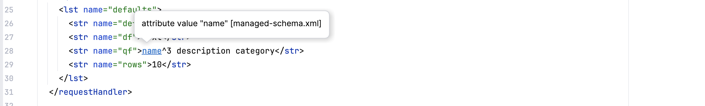

# User guide

> **Who this is for.** A Solr developer using this plugin day to day, looking up what a specific
> gesture (hover, completion, Alt-Enter) does and what it should show. Solr schema vocabulary is
> linked to the glossary throughout; IntelliJ Platform vocabulary is assumed only where a Java
> engineer would already recognise the UI gesture (hover, Alt-Enter) rather than its internal name.
> **Read first:** [Glossary](glossary.md) if Solr terms are new · [Project orientation](project-orientation.md)

Everything the plugin does today, organised by what you are trying to do rather than by which
IntelliJ [extension point](glossary.md#extension-point) implements it. This is the
configuration-files surface only — the
[server](../specs/plans/0002-solr-intellij-plugin-plan.md#server-track) and
[code](../specs/plans/0002-solr-intellij-plugin-plan.md#code-track) surfaces the specification
describes are not built yet, and this guide does not pretend otherwise. See
[the project orientation](project-orientation.md) for how the three fit together, and
[the implementation plan](../specs/plans/0002-solr-intellij-plugin-plan.md) for what "done" means for
each capability below.

## Following along

Every gesture here is reproducible against the committed demo project, which is also what the
[manual test suite](manual-test-suite.md) presses and what the [screenshots](screenshots.md) are
captured from:

```bash
./gradlew runIde
```

The [sandbox](glossary.md#sandbox) opens `demo/` and activates the plugin immediately — it declares
`org.apache.solr:solr-solrj`, which passes the outer activation gate, and carries a real
[configset](glossary.md#configset) under `demo/solr/conf/`. Open
`demo/solr/conf/managed-schema.xml` first; most of what follows lives there, and
`demo/solr/conf/solrconfig.xml` is the other file this guide reaches into — see the glossary for
[managed-schema](glossary.md#managed-schema) and [solrconfig.xml](glossary.md#solrconfigxml) if
either is unfamiliar. If nothing below happens when you try it, see
[when nothing activates](contributing.md#when-nothing-activates) in the contributing guide before
assuming a feature is broken.

**Line numbers below name the demo [fixture](glossary.md#fixture) as committed and will drift as the
demo changes.** Where a
gesture edits the file, it says so, and every edit here is meant to be undone afterwards — the demo is
a committed fixture, not a scratchpad. `git status --short demo/` should read empty when you are done.

**Check IDs in parentheses** (`HINT-1`, `NAV-3`, and so on) point at the
[manual test suite](manual-test-suite.md), which owns the exact wording of each gesture and its
expected outcome, plus whether it has actually been pressed against a running sandbox and when. This
guide explains *why* a capability exists and roughly what you will see; the manual suite is the
authority on the precise result.

---

## What can this field actually match?

**What it does.** Beside every [field](glossary.md#field) declaration, an inline hint states what a
search against that field can actually do — whole-value or tokenised, case-sensitive or not,
prefix-capable or not — and, beside it, the storage shape that decides whether a matched document can
be returned at all: [indexed](glossary.md#indexed), [stored](glossary.md#stored), doc-valued, single-
or [multi-valued](glossary.md#multivalued). This is read from the field's own
[analyzer chain](glossary.md#analyzer-chain) — the [tokenizer](glossary.md#tokenizer) and
[filters](glossary.md#filter) Solr would run at index time — rather than asserted from the type's
class name.
A `TextField` using `KeywordTokenizerFactory` reads as **whole-value** despite the class name, because
that tokenizer emits the entire input as one term, so the field matches exactly as a `StrField` does.

**Order decides it, not just which [factories](glossary.md#factory) are present.** A
`WordDelimiterFilterFactory` placed
*after* that keyword tokenizer splits the single term again, and the field reads as tokenised despite
its tokenizer — with the hint's evidence naming the filter that made it true rather than the tokenizer
it overrode.

Two silences matter as much as the hints themselves. A field whose analyzer chain names a factory the
plugin does not recognise still shows its storage shape, with no match claim — a wrong hint is worse
than none. A field whose `type` names nothing the schema declares gets no hint at all, because nothing
here is knowable.

**Try it.** Open `managed-schema.xml` and look at the field block starting around line 66 — no
gesture needed, the hints render themselves. `id`, `sku` and `category` read whole-value and
case-sensitive; `description` and `text` (type `text_general`) read tokenised and case-insensitive;
`name_prefix` additionally reads prefix-capable. `notes` (type `custom_text`, whose analyzer names an
unrecognised factory) keeps only the storage-shape phrases; `legacy` (type `discontinued`, undeclared
in the schema) shows nothing at all. (`HINT-1` through `HINT-5`)


---

## Getting documentation without leaving the file

Quick documentation (**F1**, or hover) answers a different question depending on exactly where the
caret sits, and every one of those positions now answers something — a gap the plugin closed later
than the rest, because the obvious first version only explained a *value* under the caret.

### On a field

**What it does.** Hovering (or F1 inside) a field's `name` shows every one of its resolved
properties, **and where each came from** — the field itself, its [field type](glossary.md#field-type),
or Solr's own default at
the schema's declared version. That third column is what no external reference can supply, because it
is about *this* schema. A **Meaning** column states the consequence of the resolved value in plain
terms — *"Whether the original value can be returned in results"* beside `stored` — rather than only
restating the property name.

**Try it.** Caret inside `name="category"` at `managed-schema.xml:70`, press F1. (`DOC-1`, `DOC-2`)


### On a class value

**What it does.** Hovering any `class="solr.…"` value — a field type, a tokenizer, a filter, a
[char filter](glossary.md#char-filter), or a `solrconfig.xml` plugin class — answers what the class
is: short name and kind, the
fully-qualified name, a one-sentence summary read from Solr's own Javadoc at build time, the
attributes it accepts, and a Reference Guide link at the version this configset declares. None of it
is fetched at edit time or copied out of the guide it links to — see [the FAQ](faq.md) for why.

**Try it.** Caret inside `class="solr.StandardTokenizerFactory"` at `managed-schema.xml:33`, F1.
(`DOC-4`)


### On the schema's own elements

**What it does.** Hovering the *tag* itself — `<schema>`, `<field>`, `<fieldType>`,
[`<dynamicField>`](glossary.md#dynamic-field), [`<copyField>`](glossary.md#copyfield),
[`<uniqueKey>`](glossary.md#uniquekey) — explains what the element is in Solr's terms, plus a
configset-specific sentence where one is knowable: which two fields a `<copyField>` joins, which
field is the unique key and of what type, how many fields use a given type.

**Try it.** Hover `<copyField>` or `<uniqueKey>` anywhere in `managed-schema.xml`. (`DOC-3`)

### On an attribute's own name

**What it does.** Hovering the attribute *name* — `name` or `type` on a `<field>`; `name` or `class`
on a `<fieldType>`; `source` or `dest` on a `<copyField>` — explains that attribute in general terms.
This is distinct from hovering the *value*, which resolves what this configset actually did with it;
the two `copyField` ends read differently from each other, since `source` and `dest` mean different
things.

**Try it.** Hover the word `source` or `dest` inside any `<copyField>` tag. (`DOC-8`)

### On a factory's individual attribute

**What it does.** Hovering an attribute written on a `<filter>`, `<tokenizer>` or `<charFilter>` — for
example `minGramSize` on an `EdgeNGramFilterFactory` — names the owning class, the value type, and
whether it is required; a hand-written **Does** row states what the attribute is for, for the couple
of dozen attributes a reader is likely to hover. An attribute the catalog does not carry, or a class
the catalog does not know, answers with nothing rather than a guess.

**Try it.** Hover `minGramSize` on the `EdgeNGramFilterFactory` filter at `managed-schema.xml:48`.
(`DOC-7`) *No image yet — see [the screenshot catalog](screenshots.md#not-yet-capturable).*

### On a factory's complete configuration

**What it does.** Hovering the *tag* of a factory (the word `filter`, not its `class` value) shows
every attribute that class accepts, not only the ones written: written attributes are bold and
labelled *on this filter*; unwritten ones show the catalog's recorded literal default, labelled *Solr
default*; an attribute the catalog cannot supply a default for —
[`luceneMatchVersion`](glossary.md#lucenematchversion) is the recurring example — shows an em dash
labelled *no default recorded*, which is the feature rather than
a gap. A custom `class` the catalog does not know offers nothing on the tag at all.

**Try it.** Hover the word `filter` (not the `class=` value) on the `EdgeNGramFilterFactory` filter at
`managed-schema.xml:48`. (`DOC-4b`) *No image yet.*

### On the schema's own [version](glossary.md#schema-version)

**What it does.** Hovering `version` on the `<schema>` root explains what the attribute decides in
general, then what *this configset's* declared value decides here — the demo's `version="1.6"` puts
[`docValues`](glossary.md#docvalues) off and [`uninvertible`](glossary.md#uninvertible) on by
default, both of which flip at 1.7. The `uninvertible` default is the one worth pausing on: with it
true, sorting or faceting on a field that has no doc values still *works*, but only because Solr
builds an in-memory field cache by un-inverting the index at query time — correct, silent, and
expensive on a large index, rather than the explicit failure the same query would get once
`uninvertible` defaults to false at 1.7. Solr changed several field defaults at that boundary without
breaking already-deployed schemas, and this is the popup that makes the boundary visible rather than
silent.

**Try it.** Hover `version` on `<schema version="1.6" …>` at `managed-schema.xml:27`. **F1 does not
raise Quick Documentation on the default macOS keymap** — it opens the platform's own Help page
instead, which has nothing to do with this plugin; Ctrl+J is the reliable gesture. (`DOC-9`)


### On a `solrconfig.xml` parameter or parser name

**What it does.** `solrconfig.xml` gets its own two documentation positions the schema provider
declines. Hovering a [request parameter's](glossary.md#request-parameter) name — `qf`, `mm`, `defType`
and 337 more — explains what
that parameter is for and names the Java constant that declares it, read from Solr's own Javadoc.
Hovering a `defType` value such as `edismax` names the query parser it selects. A parameter or name
Solr itself does not declare — your own custom component's — answers with nothing, which is the
honest response: a generator built from Solr's own source can never see a plugin outside it.

**Try it.** F1 on `qf` inside `solrconfig.xml`'s `<str name="qf">` (line 28), or on `class=` inside a
`<requestHandler>` such as the `/select` handler at line 24. (`PRM-9`, `CAT-4`)

---

## Discovering what you're allowed to write

Completion answers two different questions, and the plugin only answers the second one as of a
relatively late step: *what value goes here* has always worked to some degree, but *what may I write
at all* — the vocabulary itself — matters more to a reader who has not yet learned it.

### The schema's own vocabulary

**What it does.** Typing `<` inside `<schema>` (or any schema element) offers the elements legal
there and nothing else. Typing a space inside an opening tag offers the attributes that element
accepts, each with a one-line summary and the values it takes — and **omits** whatever the tag
already carries, since an attribute cannot legally appear twice. Where a boolean's default is
knowable, the default value is marked; where it depends on the field's type, neither is marked, rather
than asserting one.

**Try it.** Caret after `stored="true"` on `managed-schema.xml:70`, **before the closing `/`**, type a
space. `indexed` and `stored` are absent from the popup because line 70 already declares them.
Undo the space afterwards. (`COMP-1` through `COMP-6`)


### Catalog-backed classes and factory attributes

**What it does.** `class=` on a `<fieldType>` offers `solr.*` field type classes; on a `<tokenizer>`
or `<filter>`, the analysis factories — each set following the Solr line this configset declares.
Once a factory class is written, attribute completion inside that tag offers *that factory's own*
attributes, read from its constructor bytecode when the plugin itself was built rather than hand
maintained.

**Try it.** Caret before the closing `/` on the `EdgeNGramFilterFactory` filter at
`managed-schema.xml:48`, type a space: `luceneMatchVersion` and `preserveOriginal` appear, each
labelled with the factory they belong to (`minGramSize` and `maxGramSize` are absent because the tag
already declares them). Undo the space afterwards. (`CAT-1`, `CAT-2`)


### `solrconfig.xml`'s own structure

**What it does.** Before this shipped, `solrconfig.xml` ran through the platform's schema-less XML
mode, which guesses completion from whatever same-named sibling tag happens to be nearby — a bad
guess in a file made almost entirely of same-named tags. Element and attribute completion here now
come from the same generated vocabulary the documentation and [inspections](glossary.md#inspection)
read, and nesting is
respected: what completes inside `<query>` is not what completes inside `<config>`, and an element
Solr no longer accepts (`nrtMode`, `mainIndex`, and three more) is never offered, anywhere.

**Try it.** Put the caret on a blank line directly inside `<config>` and type `<`: the offer is Solr's
own top-level vocabulary, not a copy of the handful of tags already written above the caret. Undo the
typed character afterwards. (`STR-1` through `STR-6`)


### Field names inside `solrconfig.xml` parameters

**What it does.** Sixteen [request-handler](glossary.md#request-handler) parameters are known to hold
field names — `qf`, `pf`,
`fl`, `sort` among them — and completion inside one of them offers the schema's own fields, with a
dynamic pattern such as `*_t` shown italicised to mark it as a pattern rather than a literal field.
Scoped narrowly on purpose: `rows` and `defType` hold no field names, a caret immediately after a
boost (`name^`) offers nothing, because completing there would produce `name^name`, and the second
token of a `sort` clause is a direction rather than a field. The `name` attribute of a `<str>` inside
`<lst name="defaults">` offers Solr's own parameter names instead — the position the vocabulary is
learnable from in the first place, since offering fields inside `qf` presumes the reader already knew
to write `qf`.

**Try it.** Caret inside `<str name="qf">` after the existing text (`solrconfig.xml:28`), **type a
space**, then invoke completion: the schema's fields are offered, `*_t` italicised. The space matters —
completion did not fire with the caret directly against existing text and no trailing whitespace, the
same rule the schema-vocabulary completion above documents. (`PRM-1` through `PRM-9`)


**Try the parameter-name half too** — add a new `<str name="` line inside `<lst name="defaults">`
and invoke completion there instead of inside a value: Solr's own parameter names are offered, each
labelled with the class that declares it and, for a family of related names, a short description
telling them apart. A parameter already set earlier in the same list is withheld — typing `qf` here
when line 28 already declares one offers only `mlt.qf` and `hl.queryFieldPattern`, not plain `qf`,
which is this behaving correctly rather than a sparse or broken popup. (`PRM-6`, `PRM-7`)


---

## Navigating and finding usages

**What it does.** Every string that names something elsewhere in the configset is a real
[reference](glossary.md#reference): Ctrl/Cmd-click (or Cmd-hover for the tooltip) jumps to the
declaration, [Find Usages](glossary.md#find-usages) (⌥F7) lists every
place a declaration is used — including across the file boundary, schema to `solrconfig.xml` — and
the result list is labelled in Solr's own vocabulary (*Field type*, *Field declaring this type*), not
the platform's generic fallback. Four reference kinds resolve: a field's `type`, a `copyField`'s
`source` and `dest`, a `solrconfig.xml` handler parameter naming a field, and a filter's resource
attribute (`words=`, `synonyms=`, `protected=`, a char filter's `mapping=`) opening the file it names.
A dynamic field such as `<dynamicField name="*_t">` reports every name its pattern actually supplies —
`body_t` in a `solrconfig.xml` parameter, for instance — not only literal spellings of the pattern
itself, which the platform's own word index cannot find on its own.

**Try it.**

- Cmd-click a field's `type="text_general"` at `managed-schema.xml:68` to jump to the
  `<fieldType name="text_general">` declaration. (`NAV-1`)
- Find Usages (⌥F7) invoked from the `<fieldType name="text_general">` declaration itself
  (`managed-schema.xml:31`) lists four usages — `name`, `description`, `text`, and the `*_t` dynamic
  field. (`NAV-3`, `NAV-7`)
- Cmd-hover `name` inside `solrconfig.xml:28`'s `<str name="qf">name^3 description category</str>`
  raises a navigation tooltip landing in the schema — each name in the string navigates on its own.
  (`NAV-4`)
- Find Usages on `<dynamicField name="*_t">` (`managed-schema.xml:84`) reports the `pf` parameter
  naming `body_t` in `solrconfig.xml`, highlighted at `body_t` alone. (`NAV-6`)
- Cmd-click `words="stopwords.txt"` at `managed-schema.xml:34` opens the resource file, including
  through `lang/`. (`NAV-5`)




**What does not navigate, and why that is correct.** `class="solr.SearchHandler"` in the demo's
`/select` handler resolves nowhere, and draws no warning for failing to — the demo depends only on
`solr-solrj`, and the class lives in `solr-core`, which is not on its classpath. A configset naming a
class outside the current project is ordinary, not wrong; documentation still answers from the
generated catalog regardless, because that needs no class on the classpath at all. (`NAV-9`, `NAV-10`)

---

## Renaming safely across a configset

**What it does.** Shift+F6 on a field, dynamic field or field type declaration
[renames](glossary.md#rename-refactoring) it everywhere a reference resolves to it — including across
the file boundary into `solrconfig.xml` — through the
same reference graph Find Usages reads. The rename dialog itself is labelled correctly (*Rename field
'category' and its usages to:*, not the platform's fallback class name), which matters because a
correct rename under a wrong-looking dialog reads as broken to everyone but its author.

**What stays deliberately partial.** Renaming a dynamic field's pattern (`<dynamicField
name="*_t">` to `*_txt`) updates the declaration and any reference that spells the pattern literally,
but leaves alone a reference the pattern only *supplies* — `body_t` in a `solrconfig.xml` parameter —
because rewriting it to `*_txt` would put a glob where a field name belongs. The unknown-field
inspection then underlines that now-orphaned name immediately, which is what makes the partial rename
defensible rather than silently wrong.

**Try it.** Caret on `category` in `<field name="category">` at `managed-schema.xml:70`, press
Shift+F6, apply directly (no Preview step needed) to rename to `product_category`: the declaration
updates and so does the `qf` line in `solrconfig.xml:28`, with no separate action. A single Cmd+Z
undoes both files as one refactoring — confirm with `git status --short demo/` afterwards. (`REN-1`,
`REN-2`)


---

## Catching mistakes before Solr does

**What it does.** Eleven inspections watch for the ways a configset fails silently — at
[core](glossary.md#core) reload, at query time, or not at all until a reader notices a query "just
doesn't work." Ten of the eleven are
held to a zero-false-positive bar: the shipped `_default` and `sample_techproducts_configs` configsets
Solr itself ships produce no findings from them, on either supported line, and a custom plugin class
with its own parameters produces none either. **The eleventh, the unused-field-type check, is held out
of that gate by name** — Solr's own shipped configsets declare dozens of language and spatial field
types for fields nobody has written yet, and the check correctly reports every one of them as unused.
That is a true fact about the file rather than a defect in it, which is why it is the one rule a
*zero findings* gate cannot hold, and why it is drawn dimmed rather than underlined below.

What they catch, briefly:

- **A `copyField` naming a field nothing declares** — flagged, with Alt-Enter offering the declared
  fields closest in spelling, dynamic patterns included as candidates.
- **A field naming an undeclared field type**, and the reverse — **a declared field type nothing
  uses** — the one finding here that is not a defect, so it is drawn dimmed rather than underlined,
  with no [quick fix](glossary.md#quick-fix): whether it is dead weight or provision for a field not
  yet written is a judgement the editor cannot make.
- **A `solrconfig.xml` handler parameter naming a field the schema does not declare.**
- **A relevance or faceting parameter naming a field that cannot serve it** — `qf` on a non-indexed
  field, `facet.field` or `sort` on a field with neither `indexed` nor `docValues`. The same field can
  be searchable and unfacetable at once, and the two checks disagree about it on purpose.
- **An analyzer chain ordering that silently defeats itself.** Every class named is legal, every
  attribute is legal, and Solr starts without complaint — this is the one finding in this list a
  reader cannot see by looking at the file alone, because the problem is not any single tag but how
  two tags relate to each other. A case-folding filter placed after a filter that already flattened
  case away runs on input with nothing left to fold, so it does nothing. A filter such as
  `SynonymGraphFilterFactory` can emit more than one token at the same position — `laptop` and
  `notebook` occupying one slot rather than a flat sequence, what Lucene calls a *token graph* — and
  `FlattenGraphFilterFactory` exists to collapse that graph back into a flat sequence for whatever
  runs after it; placed *before* the filter that produces the graph instead of after it, it flattens
  nothing, and the graph reaches a downstream filter that cannot represent alternatives at all.
- **A configuration element Solr no longer accepts** — reported in Solr's own retirement sentence,
  naming its replacement where Solr names one.
- **A parameter name that is almost one Solr reads** — an edit-distance check that knows the
  difference between a typo and a genuinely different but similar parameter (`pf2` beside `pf3`),
  because it checks knownness before distance.
- **An unknown attribute, or a value outside a closed set** — `indexed="yes"` instead of `"true"`.

**Try it.** `managed-schema.xml`, untouched, shows exactly two warnings — a planted dangling
`manufacturer` copyField and a planted undeclared field type — and nothing else; `solrconfig.xml`
shows none. Both are deliberate fixtures and should never be "fixed." (`BASE-1`, `BASE-2`)


---

## Seeing what's already redundant

**What it does.** An attribute whose written value equals what Solr would have supplied anyway
renders dimmed — the same idiom an IDE uses for any other redundant code, at information severity,
never reaching the Problems view, because a restated default is correct rather than wrong. An
Alt-Enter [intention](glossary.md#intention) on a dimmed attribute removes it, leaving a schema whose
resolved properties are
identical. The comparison covers both field properties (`indexed`, `stored`, and the rest, resolved
through three tiers — field, field type, Solr's own default) and analysis-factory attributes, judged
against the literal default the catalog read out of that factory's own bytecode. Wherever the default
cannot be determined with confidence, nothing dims — a custom field type class the catalog does not
know, for instance.

**Try it.** Open `managed-schema.xml` untouched — no edit needed. `indexed="true"` and
`stored="true"` render dimmed across the field block; `stored="false"` on `name_prefix` renders at
full strength. (`DIM-1` through `DIM-4`)


---

## Fixing a missing capability automatically

**What it does.** Two Alt-Enter intentions write a new field into the schema, generated from a field
that lacks a capability it might want: a `_exact` companion (a `StrField`-backed whole-value field,
useful for sorting and faceting a tokenised field's content) and a `_prefix` companion (an
EdgeNGram-backed field supporting efficient prefix queries). Both generate the companion `<field>`,
its `<fieldType>` where one does not already exist, and the `<copyField>` rule joining the two — and
both stop offering themselves once the companion exists, or if the field is already whole-value and
so never needed the `_exact` half. This is the plugin's first capability that edits a configset rather
than only explaining or flagging one, and it edits directly with no confirmation dialog, the same
policy [every write in this plugin follows](code-organization.md#rules-that-hold-across-every-package).

**Try it.** Caret inside `description` (`managed-schema.xml:71`, a `text_general` field), press
Alt-Enter: **Add exact-match companion field (string)** and **Add prefix-capable companion field
(text_prefix)** appear above the platform's own generic items. Applying either produces a schema that
still parses. (`INT-1`, `INT-2`)


---

## What is not here yet

Nothing server-side (a live connection, browsing [collections](glossary.md#collection), a query
console, the repository-vs-server drift view) and nothing in Java or Kotlin code (field-name checks
against [SolrJ](glossary.md#solrj) calls, query-syntax
injection) exists yet. [The specification](../specs/0002-solr-intellij-plugin.md) describes the intent
for both; [the implementation plan](../specs/plans/0002-solr-intellij-plugin-plan.md) is the only place
that says what is actually built, today, and it is worth reading directly rather than trusting a
summary — including this one.
